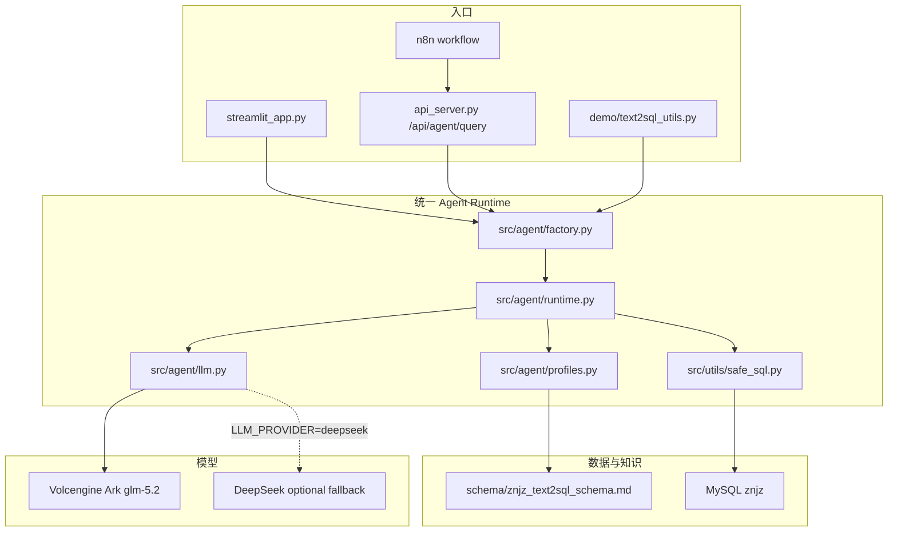
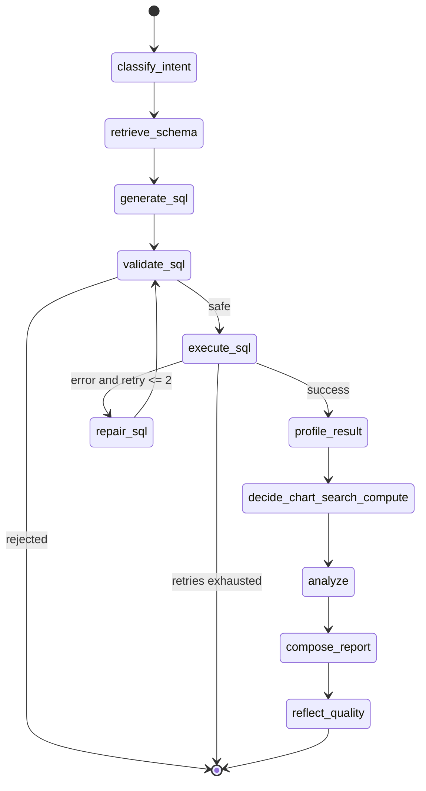

# Text2SQL Analysis

面向地区产业发展分析的 Text2SQL Agent 项目。当前主线已经收敛为统一的 `AgentRuntime`：Streamlit、公网 UI、FastAPI、n8n 和 demo 入口共享同一条 SQL 生成、校验、执行、修复和报告链路。

当前主实验库是 `znjz` 智能制造数据库。旧 `Gaaiyun` / `gaaiyun_2`、Vanna 训练脚本和早期 Web 入口保留为兼容资产，不再作为第一版公网体验的主路径。

简单说：用户输入一句自然语言问题，系统读取 `znjz` schema 知识库，让大模型生成 SQL；SQL 必须先过安全校验，确认只查白名单表、只执行 `SELECT`、带 `LIMIT`，再查询 MySQL，最后返回表格、图表建议和 Markdown 分析报告。

这个项目现在要解决三件事：

1. 给别人一个能公网访问的智能制造数据问答页面。
2. 给 n8n、API 或后续前端一个稳定的 Text2SQL 后端入口。
3. 给开发者一套可测试、可回滚、可继续扩展的 Agent Runtime，而不是散落脚本各写一套逻辑。

## 当前主线

| 项 | 当前选择 |
| --- | --- |
| 公网入口 | `streamlit_app.py` |
| Agent runtime | `src/agent/runtime.py`，优先 LangGraph，缺依赖时线性 fallback |
| LLM provider | 默认火山方舟 Coding Plan，OpenAI-compatible |
| 默认模型 | `glm-5.2` |
| 主数据库 profile | `znjz` |
| Schema 知识库 | `schema/znjz_text2sql_schema.md` |
| SQL 安全层 | `src/utils/safe_sql.py` |
| API | `POST /api/agent/query` |
| 部署目标 | Streamlit Cloud |

Streamlit Cloud 创建应用时填写：

- Repository: `gaaiyun/text2sql-analysis`
- Branch: `main`
- Main file path: `streamlit_app.py`

不要填写 `/streamlit_app.py`。

## 入口怎么选

| 你要做什么 | 使用入口 | 说明 |
| --- | --- | --- |
| 给外部人员体验 | Streamlit Cloud | 访问者输入 `APP_PASSWORD` 后直接提问、看 SQL、表格、图表和报告 |
| 给自动化流程调用 | `POST /api/agent/query` | n8n、后续前端或脚本都应优先走这个接口 |
| 本地调试 Agent | `AgentRuntime` / `create_agent_runtime()` | 直接测试状态机、SQL 安全层和 profile |
| 兼容旧 demo | `demo/text2sql_utils.py` | 旧入口保留，但内部委托新 runtime |
| Vanna 训练或旧方案复现 | `scripts/train_vanna*.py` | 可选兜底，不是当前主线 |

## 快速开始

```powershell
cd G:\text2sql-analysis
python -m pip install -r requirements.txt
```

配置环境变量或本地 `.env`。不要提交 `.env` 或 `.streamlit/secrets.toml`。

```env
LLM_PROVIDER=volcengine_ark
VOLCENGINE_ARK_BASE_URL=https://ark.cn-beijing.volces.com/api/coding/v3
VOLCENGINE_ARK_API_KEY=your-volcengine-ark-api-key-here
VOLCENGINE_ARK_MODEL=glm-5.2
APP_PASSWORD=change-me

DB_HOST_SCENARIO_1_3=your-db-host
DB_PORT_SCENARIO_1_3=3306
DB_NAME_SCENARIO_1_3=znjz
DB_USER_SCENARIO_1_3=znjz
DB_PASSWORD_SCENARIO_1_3=your-db-password
```

本地启动 Streamlit：

```powershell
streamlit run streamlit_app.py
```

本地启动 FastAPI：

```powershell
python api_server.py
```

## Streamlit Cloud 部署

详细步骤见 [docs/STREAMLIT_DEPLOY.md](docs/STREAMLIT_DEPLOY.md)。

部署前先跑：

```powershell
python scripts/check_streamlit_readiness.py
python -m pytest -q
```

Streamlit Cloud 的 Advanced settings 建议：

- Python version：`3.11` 或 `3.12`，不要先用过新的解释器版本。
- Main file path：`streamlit_app.py`。
- Secrets：使用 `.streamlit/secrets.toml.example` 中的键名，按 TOML 格式填写。

生产部署前请轮换任何曾在聊天、日志或截图中出现过的模型 Key。

部署后先用这些问题验收：

| 场景 | 问题示例 | 看什么 |
| --- | --- | --- |
| 经营状态 | `统计不同经营状态的企业数量` | 是否使用企业主表并返回分组数量 |
| 行业 Top | `按行业统计企业数量 Top 10` | 是否按行业字段聚合并排序 |
| 融资轮次 | `各融资轮次的企业数量是多少` | 是否查询融资事实表，不编造空轮次 |
| 招投标年度 | `按年份统计招投标数量` | 是否正确从日期字段取年份 |
| 企业详情 | `查询某家企业的基本信息、资质和招投标记录` | 是否先聚合一对多事实再关联企业主表 |

## 架构



## Agent 流程



核心约束：

- 只允许 SELECT。
- 拒绝多语句。
- 拒绝非白名单表。
- 自动补 `LIMIT`。
- SQL 执行失败最多修复重试 2 次。
- 空数据必须明确说明，不编造结论。
- 企业详情先聚合一对多事实子查询，再 JOIN 企业主表。

## SQL 生成提示词

`znjz` profile 的提示词不只依赖长 schema，还显式内置了：

- 高频字段地图：自然语言表达到真实表和字段的映射。
- 易错字段反例：例如禁止生成 `industry_name`、`city_name`、`company_name`、`finance_round` 等当前库不存在的字段。
- 场景决策规则：分布、Top、趋势、区间、企业详情等问题的 SQL 形态。
- 标准问题模板：经营状态、行业 Top、融资轮次、招投标年度、资质年份、地区分布、成立趋势、投资 Top、注册资本区间、企业详情。

## API

### `POST /api/agent/query`

请求：

```json
{
  "question": "按行业统计企业数量 Top 10",
  "scenario": "industry",
  "password": "optional-app-password"
}
```

响应包含：

```json
{
  "success": true,
  "sql": "...",
  "safe_sql": "...",
  "columns": [],
  "rows": [],
  "row_count": 0,
  "analysis": "...",
  "report": "...",
  "chart": {},
  "safety": {},
  "trace": []
}
```

旧接口 `/api/query`、`/api/query/llm`、`/api/query/vanna` 仍保留兼容，但新开发默认使用 `/api/agent/query`。

## 目录结构

```text
.
├── streamlit_app.py                 # Streamlit Cloud 主入口
├── api_server.py                    # FastAPI，含 /api/agent/query
├── src/
│   ├── agent/                       # 当前主线 Agent Runtime
│   └── utils/safe_sql.py            # SQL 安全校验和 LIMIT 改写
├── schema/
│   └── znjz_text2sql_schema.md      # znjz Text2SQL 知识库
├── docs/
│   ├── ARCHITECTURE.md              # 架构说明和 Mermaid 图
│   ├── STREAMLIT_DEPLOY.md          # Streamlit Cloud 部署手册
│   ├── ACCEPTANCE_RESULTS.md        # 真实验收记录
│   └── legacy/                      # 早期历史文档归档
├── workflows/                       # n8n 工作流
├── demo/                            # 旧 demo 入口，内部委托 AgentRuntime
├── scripts/                         # 运维、验收和 legacy 工具脚本
└── tests/                           # 单元、API、部署契约和安全测试
```

## scripts 目录边界

当前维护脚本：

| 脚本 | 用途 |
| --- | --- |
| `scripts/check_streamlit_readiness.py` | 检查 Streamlit 部署入口、依赖、secrets 模板和文档契约 |
| `scripts/run_agent_acceptance.py` | 用 `znjz` 跑 10 个标准验收问题并保存 JSON/Markdown 产物 |
| `scripts/check_security.py` | 提交前敏感信息扫描 |
| `scripts/test_db_simple.py` | 数据库连通性辅助检查 |

兼容或 legacy 脚本：

| 脚本类型 | 说明 |
| --- | --- |
| `train_vanna*.py`、`generate_vanna_training.py`、`setup_vanna_kiro.py` | Vanna/旧训练链路保留，不是第一版主依赖 |
| `extract_schema*.py` | 早期 schema 提取辅助工具 |
| `export_excel.py`、`export_word.py`、`web_search.py` | 旧 API 周边能力，保留兼容 |
| `deploy.*`、`start_web.*` | 旧 Web/API 启动脚本，不用于 Streamlit Cloud |
| `test_quick.py`、`validate_sql.py` | 早期手动检查脚本，保留但不作为主验收标准 |

后续如果要物理清理脚本，应先更新对应测试和旧文档引用，再移动到 `scripts/legacy/` 或删除。

## 开发和维护约定

- 新功能优先接入 `src/agent/`，不要在 Streamlit、FastAPI、n8n 或 demo 里各自重写 SQL 生成逻辑。
- 新数据库优先新增 `DatabaseProfile`、schema 文档、白名单表和验收问题，不要把字段映射硬编码到入口层。
- 新 SQL 行为必须先补 `safe_sql` 测试，再接 runtime 或 API。
- 新公网配置只写 `.env.example` 或 `.streamlit/secrets.toml.example`，真实 key、数据库密码和页面口令只放本地或 Streamlit Cloud secrets。
- 临时脚本如果只为一次性排查使用，完成后不要留在根目录；确实要保留时写入 `scripts/README.md` 的状态表。
- 合并前至少跑 `python scripts/check_streamlit_readiness.py` 和 `python -m pytest -q`。

## 测试

常用验证：

```powershell
python scripts/check_streamlit_readiness.py
python -m pytest -q
black --check scripts/ tests/
isort --check-only scripts/ tests/
flake8 scripts/ tests/ --count --select=E9,F63,F7,F82 --show-source --statistics
```

当前已验证状态见 [docs/ACCEPTANCE_RESULTS.md](docs/ACCEPTANCE_RESULTS.md)。

## 安全

- 不提交 `.env`、`.env.local`、`.streamlit/secrets.toml`、`config.json`。
- 生产 secrets 只放 Streamlit Cloud Advanced settings。
- SQL 执行前统一经过 `safe_sql.enforce_safe_sql()`。
- Streamlit 第一版只做简单 `APP_PASSWORD` 口令，不做账号体系。
- Streamlit Cloud 访问 MySQL 时，如果没有固定出口 IP，需要临时开放访问或改用数据库代理/云数据库白名单方案。

## 常见问题

### Streamlit 提示找不到 `/streamlit_app.py`

Main file path 填错了。应该填 `streamlit_app.py`，不要加开头的 `/`。

### Streamlit Advanced settings 要不要填

要填。Secrets 框里放模型、数据库和 `APP_PASSWORD`，Python version 建议选 `3.11` 或 `3.12`。不要把这些内容提交到仓库。

### 页面能打开，但查询失败

按顺序检查：

1. Streamlit Cloud secrets 是否包含全部 `VOLCENGINE_ARK_*`、`APP_PASSWORD` 和 `DB_*`。
2. MySQL 是否允许 Streamlit Cloud 访问。
3. 火山方舟 Key 是否有效、模型名是否为 `glm-5.2`。
4. 问题是否超出 `znjz` schema 的表白名单。

### 为什么还有 Vanna、旧 Web 和旧脚本

这些是兼容资产，保留是为了不破坏旧工作流和旧测试。当前主线是 `AgentRuntime` + `znjz` + Streamlit Cloud；后续清理 legacy 脚本应先确认没有文档、测试或旧入口依赖。

## 文档入口

- [docs/ARCHITECTURE.md](docs/ARCHITECTURE.md)
- [docs/STREAMLIT_DEPLOY.md](docs/STREAMLIT_DEPLOY.md)
- [docs/ACCEPTANCE_RESULTS.md](docs/ACCEPTANCE_RESULTS.md)
- [docs/SECURITY_CONFIG.md](docs/SECURITY_CONFIG.md)
- [docs/n8n_integration.md](docs/n8n_integration.md)
- [scripts/README.md](scripts/README.md)
