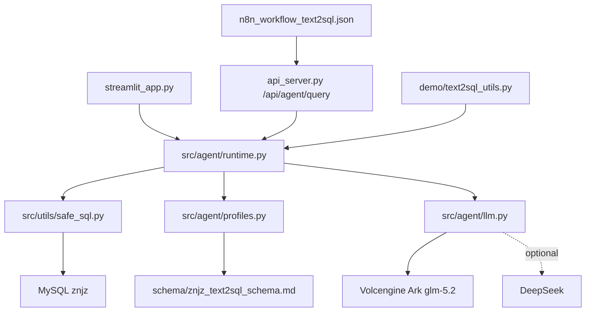

# Text2SQL Agent 交接文档

> 这是一份活文档。后续每次出现能影响开发、部署、数据或验收的变化，都要直接追加到这里，不要另起一份新的交接说明。

## 先读什么

新接手的 agent 先按这个顺序看：

1. [README.md](../README.md)
2. [docs/ARCHITECTURE.md](ARCHITECTURE.md)
3. [docs/STREAMLIT_DEPLOY.md](STREAMLIT_DEPLOY.md)
4. [docs/BT_MYSQL_EXCEL_IMPORT.md](BT_MYSQL_EXCEL_IMPORT.md)
5. [docs/ACCEPTANCE_RESULTS.md](ACCEPTANCE_RESULTS.md)
6. [scripts/README.md](../scripts/README.md)
7. [src/agent/runtime.py](../src/agent/runtime.py)
8. [src/agent/profiles.py](../src/agent/profiles.py)
9. [src/utils/safe_sql.py](../src/utils/safe_sql.py)

## 当前项目状态

- 项目主线：`Text2SQL Agent Runtime + znjz 智能制造数据库 + Streamlit Cloud`
- 主仓库：`G:\text2sql-analysis`
- 数据源目录：`G:\text2sql_0705`
- 当前分支：`main`
- 当前远端跟踪：`origin/main`
- 当前本地状态：`main` 比远端 `ahead 1`，并且工作区还有未提交改动

当前未提交改动主要是：

- `README.md`
- `docs/AGENT_HANDOFF.md`
- `docs/SECURITY_CONFIG.md`
- `docs/STREAMLIT_DEPLOY.md`
- `scripts/README.md`
- `scripts/export_mysql_text2sql_schema.py`
- `tests/test_export_mysql_text2sql_schema.py`

如果要继续开发，先看清这些改动是否属于当前目标，不要误删。

## 这套系统现在怎么跑



核心约束：

- 只允许 `SELECT`
- 拒绝多语句
- 拒绝非白名单表
- 自动补 `LIMIT`
- SQL 执行失败最多重试 2 次
- 空数据必须明确说明，不准编造结论

## 当前数据与 schema 的 source of truth

### 数据目录

`G:\text2sql_0705` 里保存的是当前这批实验数据和导入资产：

- `znjz_gzldata_step1.xls`
- `znjz_gzldata_step2.xlsx`
- `znjz_gzldata_step3.xlsx`
- `znjz_gzldata_step4.xlsx`
- `znjz_gzldata_step5.xlsx`
- `znjz_gzldata_step6.xlsx`
- `znjz_mysql_schema.sql`
- `znjz_text2sql_schema.md`
- `znjz_data_profile.json`
- `scripts\import_znjz_excel_to_mysql.py`

### schema 目录

`G:\text2sql-analysis\schema` 里现在的知识库文件是：

- `znjz_text2sql_schema.md`
- `gaaiyun_schema.md`
- `gaaiyun_2_schema.md`
- `question_sql_examples.md`

当前主线只把 `znjz_text2sql_schema.md` 当作运行时知识库。

### schema 重新导出代码

如果数据变化，需要重新导出 schema，优先用：

- `scripts/export_mysql_text2sql_schema.py`

这个脚本会从 MySQL `information_schema` 和 `SHOW CREATE TABLE` 导出 Markdown schema 和 DDL SQL。

## 运行时关键文件

| 文件 | 作用 |
| --- | --- |
| `src/agent/runtime.py` | 统一 AgentRuntime，SQL 生成、校验、执行、修复、分析、报告都在这里串起来 |
| `src/agent/factory.py` | 从环境变量 / secrets 构造 runtime |
| `src/agent/profiles.py` | `znjz` 数据库 profile、白名单表、场景规则、SQL 指南 |
| `src/agent/llm.py` | 火山方舟 / DeepSeek 的 OpenAI-compatible provider |
| `src/utils/safe_sql.py` | SQL 安全层，白名单、SELECT-only、LIMIT 改写 |
| `streamlit_app.py` | 公网 UI 主入口 |
| `api_server.py` | FastAPI 主入口，`POST /api/agent/query` |
| `scripts/run_agent_acceptance.py` | 10 个标准验收问题，输出 JSON + Markdown |
| `scripts/check_streamlit_readiness.py` | Streamlit 部署契约检查 |
| `scripts/check_security.py` | 提交前敏感信息扫描 |

## 配置清单

### 模型配置

- `LLM_PROVIDER`
- `VOLCENGINE_ARK_BASE_URL`
- `VOLCENGINE_ARK_API_KEY`
- `VOLCENGINE_ARK_MODEL`
- `DEEPSEEK_BASE_URL`
- `DEEPSEEK_API_KEY`
- `DEEPSEEK_MODEL`

### 页面访问控制

- `APP_PASSWORD`

### 数据库配置

- `DB_HOST_SCENARIO_1_3`
- `DB_PORT_SCENARIO_1_3`
- `DB_NAME_SCENARIO_1_3`
- `DB_USER_SCENARIO_1_3`
- `DB_PASSWORD_SCENARIO_1_3`

### 配置原则

- 真实值只放本地环境变量或 Streamlit Cloud Secrets
- 不写进仓库
- 不写进报告
- 不写进日志
- 不写进截图

## 部署和验收

### 本地检查

```powershell
python scripts/check_streamlit_readiness.py
python scripts/check_security.py
python -m pytest -q
```

### 关键验收

- `tests/test_agent_runtime.py`
- `tests/test_api_agent_endpoint.py`
- `tests/test_safe_sql.py`
- `tests/test_schema_validation.py`
- `tests/test_deployment_contracts.py`
- `tests/test_export_mysql_text2sql_schema.py`

### 已有验收结果

参考 [docs/ACCEPTANCE_RESULTS.md](ACCEPTANCE_RESULTS.md)。

那次验收的结论是：

- `znjz` 10 个标准问题都通过
- Streamlit 本地烟测通过
- 图表、SQL、报告、Trace 都能返回

## 开发历史

### 第一阶段：旧脚本时代

- 早期 Text2SQL 逻辑分散在 API、demo、Web、Vanna 训练脚本里
- schema 主要靠 `extract_schema.py` / `extract_schema_essential.py`
- 这一阶段的问题是入口散、提示词不稳、SQL 安全边界不统一

### 第二阶段：统一 Agent Runtime

- 把主线收敛到 `src/agent/runtime.py`
- 新增 `src/agent/factory.py`、`src/agent/profiles.py`、`src/agent/llm.py`
- 把 SQL 安全层统一到 `src/utils/safe_sql.py`
- `streamlit_app.py`、`api_server.py`、demo、n8n 共享同一条链路

### 第三阶段：`znjz` 主实验库

- 用新的 6 个本地表替换旧实验数据
- 数据导入走 `G:\text2sql_0705\scripts\import_znjz_excel_to_mysql.py`
- 生成 `G:\text2sql-analysis\schema\znjz_text2sql_schema.md`
- 在 `src/agent/profiles.py` 里固化白名单表、兼容视图和 SQL 指南

### 第四阶段：公网体验和部署

- 目标部署改为 Streamlit Cloud
- 只保留简单口令 `APP_PASSWORD`
- 真实模型和数据库连接全部放 secrets
- `docs/STREAMLIT_DEPLOY.md` 和 `scripts/check_streamlit_readiness.py` 用来卡部署契约

### 第五阶段：交接准备

- 补充 `docs/BT_MYSQL_EXCEL_IMPORT.md`
- 补充 `docs/ACCEPTANCE_RESULTS.md`
- 补充 `docs/SECURITY.md`
- 创建 `docs/AGENT_HANDOFF.md`
- 维持这份文档持续更新

## Git 历史

当前可见的近期提交：

- `5eeea29` `docs(import): 增加宝塔数据库导入手册`
- `f75afb6` `docs(readme): 完善使用说明和维护规范`
- `a2d5568` `docs(readme): 收敛主线说明并标注脚本边界`
- `e219ad6` `feat(agent): 重构Text2SQL运行时并接入Streamlit`
- `7667c82` `docs(deploy): 明确Streamlit主分支部署路径`
- `603882f` `test(deploy): 增加Streamlit部署就绪检查`
- `eeb72a9` `fix(agent): 强化SQL生成提示词并修复CI格式`
- `1f013cc` `feat(agent): 重构Text2SQL运行时并接入Streamlit`

这条线说明：

- 主线已经不是旧脚本拼接
- 现在的核心是 AgentRuntime + schema profile + safe_sql
- README、部署文档和验收文档已经在收口

## 需要恢复 Codex / Claude 历史时看哪里

### Codex / Claude 历史路径

- `G:\ClaudeCode\readable\`
- `G:\ClaudeCode\archive\`
- `G:\ClaudeCode\项目恢复提示词.md`
- `G:\codex-home\memories\MEMORY.md`
- `G:\codex-home\memories\rollout_summaries\`
- `C:\Users\gaaiy\.claude\projects` 这个目录是 junction，实际数据在 `G:\ClaudeCode\_projects-store`

### 恢复时的顺序

1. 先看这份交接文档
2. 再看 `README.md` 和 `docs/ARCHITECTURE.md`
3. 再看 `docs/ACCEPTANCE_RESULTS.md`
4. 再看 `G:\ClaudeCode\readable\` 里的历史
5. 必要时去 `G:\codex-home\memories\rollout_summaries\` 找对应 session

## 其他相关仓库

### 技能仓库

- 本地技能目录：`G:\codex-home\skills\industry-nl2sql-report`
- GitHub 仓库：`gaaiyun/industry-nl2sql-report`

这是一个独立的可复用 skill 包，已经脱敏，适合给其他 agent 直接装载。

## 维护规则

- 不要另起一份新的交接文档
- 新增重要改动时，直接往这份文档底部追加
- 追加时写清楚日期、做了什么、影响了哪些文件、验证了什么
- 不要把真实 Key、密码、cookie、token 写进文档
- 如果要删 legacy 脚本，先确认 README、docs、tests 都不再引用

## 后续建议

1. 把当前未提交的 schema 导出脚本和测试整理成一个干净 commit
2. 把 `scripts/export_mysql_text2sql_schema.py` 接到正式的维护脚本说明里
3. 如果 `znjz` 数据再换一批，先更新导入脚本，再重导 schema，再跑 acceptance
4. 如果要继续公网化，再补一层数据库访问隔离，不要只靠口令

## 追加日志

### 2026-07-26

- 创建这份交接文档
- 汇总了当前仓库状态、数据源、runtime 架构、部署路径、验收命令和历史恢复路径
- 记录了 `znjz` 主实验库、6 个本地 Excel、schema 导出脚本和技能仓库的位置
- 明确了这份文档以后要持续追加，不要拆分

### 2026-07-26 · ChainLens 场景应用接手

- 已提交本仓库交接与 schema 导出成果：`86dc194`。
- 根据数据要素竞赛目标，继续维护姊妹项目 `G:\chainlens`：定位为“中小制造企业经营增信与产业体检”场景应用，不把 `text2sql-analysis` 的查询工具和场景应用混成一个仓库。
- `G:\chainlens` 已完成四个确定性分析内核和 Agent 编排层，结论不依赖 LLM；已跑真实 DuckDB 数据并生成四个场景的 Markdown、HTML、PDF、PNG 产物。
- ChainLens 当前真实验证：
  - `python -m pytest -q` -> `11 passed in 17.76s`
  - `python scripts/check_security.py` -> `[OK] security scan passed`
  - `python scripts/run_pipeline.py --output-dir G:\chainlens\data\outputs\acceptance_20260726` -> 融资、资质、网络、区域四场景全部成功
- ChainLens 新增 `web/` 工业编辑室风格静态前端、`api_server.py` 和 GitHub Pages workflow；Playwright 已验证桌面/移动端首屏、场景切换、快照下载。
- ChainLens 详细交接入口：[G:\chainlens\docs\AGENT_HANDOFF.md](../../chainlens/docs/AGENT_HANDOFF.md)。后续涉及竞赛立意、确定性内核、报告产物或前端，应优先更新 ChainLens 的同一份活文档。
