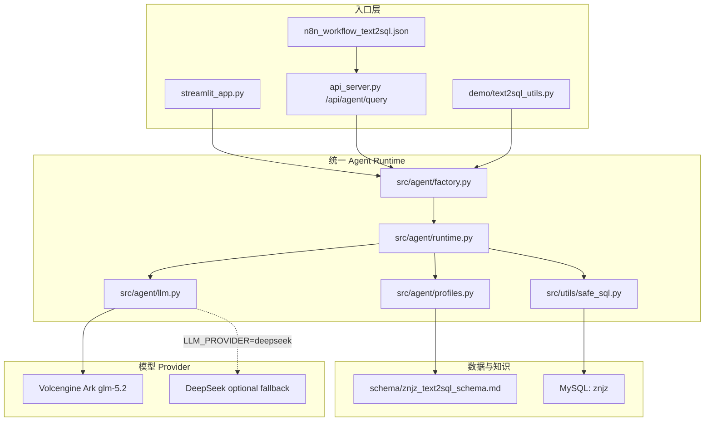
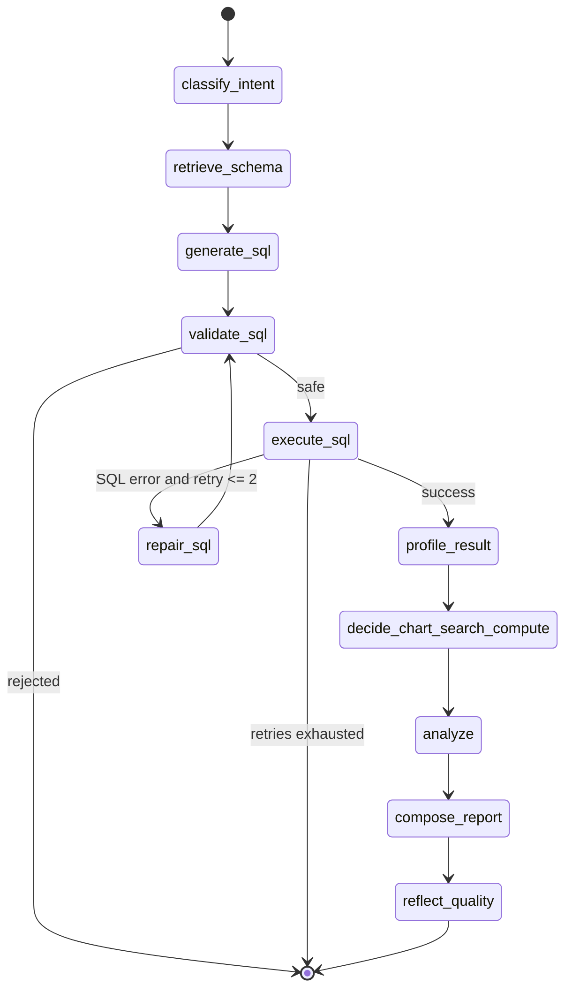
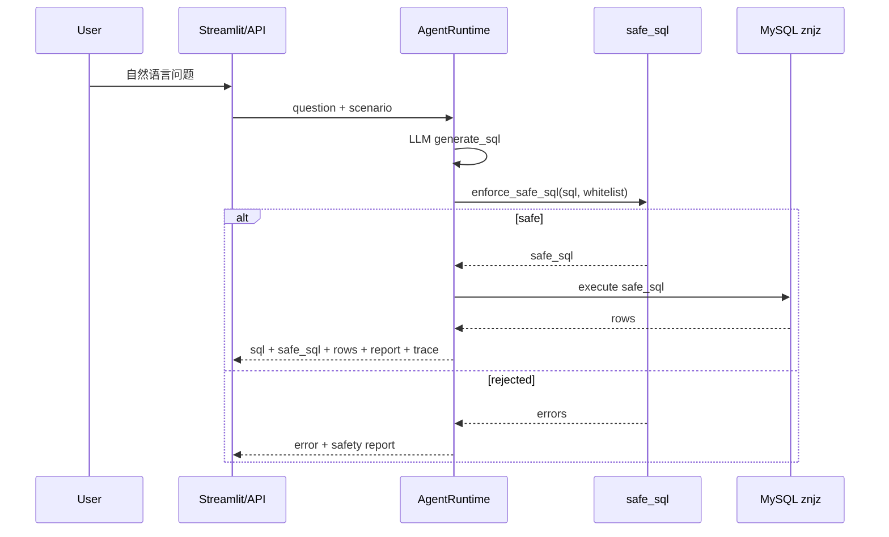

# Text2SQL Agent Runtime 架构说明

## 目标

本次重构把原先分散在 API、Demo、n8n、Web 入口中的 Text2SQL pipeline 收敛为统一的 `AgentRuntime`。所有入口只负责收参、鉴权和展示，SQL 生成、校验、执行、修复、分析和报告都由同一条执行链路完成。

## 总体架构

## 状态机

`AgentRuntime` 优先使用 LangGraph；运行环境没有 `langgraph` 时保留同语义的线性 fallback，避免本地基础测试因为可选依赖缺失而无法运行。

节点职责：

- `classify_intent`：记录场景和是否需要报告。
- `retrieve_schema`：加载 `znjz_text2sql_schema.md`。
- `generate_sql`：调用 OpenAI-compatible LLM 生成 MySQL SELECT。
- `validate_sql`：统一调用 `enforce_safe_sql()`，拒绝非 SELECT、多语句和非白名单表，必要时补 `LIMIT`。
- `execute_sql`：只执行安全 SQL。
- `repair_sql`：SQL 执行失败时带错误和 schema 让 LLM 修复，最多重试 2 次。
- `profile_result`：记录字段、行数和结果形状。
- `decide_chart_search_compute`：基于字段类型生成简单图表建议。
- `analyze`：只基于真实返回结果分析；空数据时明确说明无数据。
- `compose_report`：生成 Markdown 报告。
- `reflect_quality`：记录质量检查 trace。

## 安全边界

关键约束：

- 所有入口执行 SQL 前都必须经过 `safe_sql.enforce_safe_sql()`。
- `znjz` profile 的白名单只包含 6 张基础表和 5 个兼容视图。
- 不允许非 SELECT、多语句和超出白名单的表。
- 自动补 `LIMIT 1000`，避免大结果集拖垮公网应用。
- API Key、数据库密码和访问口令只从环境变量或 Streamlit Secrets 读取。

## Provider 抽象

`src/agent/llm.py` 提供 `OpenAICompatibleProvider` 基类：

- 默认 `LLM_PROVIDER=volcengine_ark`，读取 `VOLCENGINE_ARK_*`。
- 备用 `LLM_PROVIDER=deepseek`，读取 `DEEPSEEK_*`。
- 两者都使用 OpenAI SDK 的 `chat.completions.create()`，入口层无需关心厂商差异。

## 数据库 Profile

`src/agent/profiles.py` 固定 `znjz` 实验库：

- Schema 文档：`schema/znjz_text2sql_schema.md`
- 白名单基础表：`企业基本信息`、`企业基本信息_行业代码`、`企业融资信息`、`企业投资股东信息`、`招投标信息`、`商标资质信息`
- 兼容视图：`企业行业代码`、`融资数据`、`投资数据`、`招投标`、`标签数据`

## 部署边界

- Streamlit Cloud 运行 `streamlit_app.py`，使用 `st.secrets`。
- FastAPI 仍可本地或云主机运行，提供 `/api/agent/query` 给 n8n 和其他系统调用。
- GitHub Pages 不适合第一版，因为不能安全持有 Python 后端、数据库连接和模型 Key。
- Cloudflare 可后续作为前端/CDN 或反向代理，不作为第一版主部署目标。
