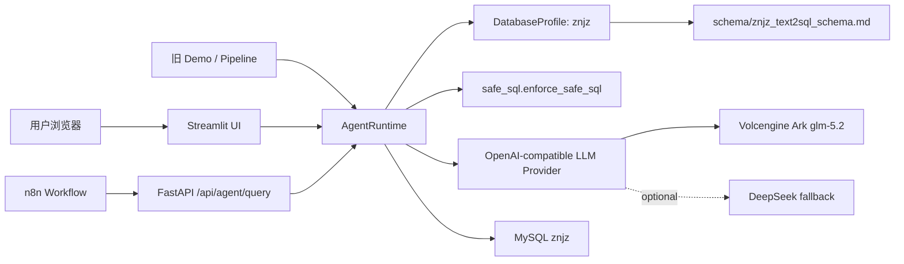
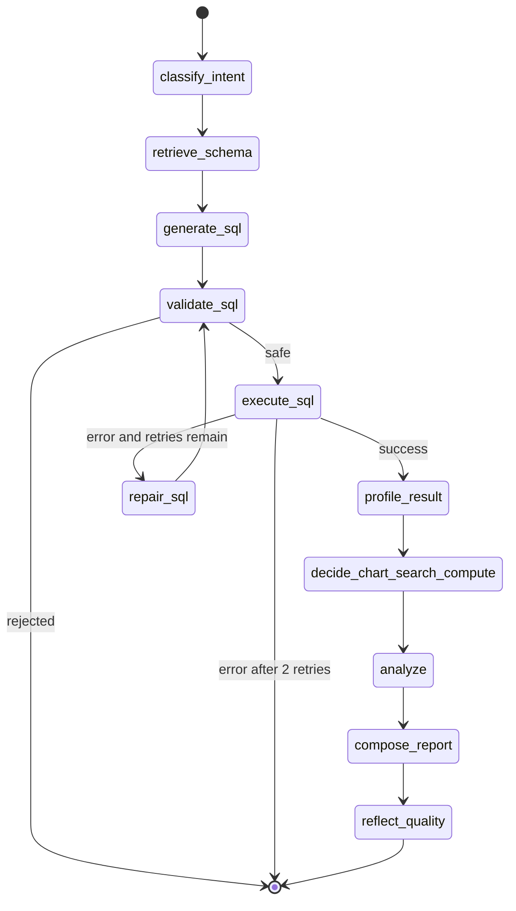
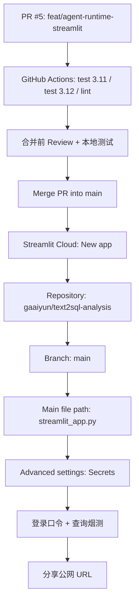

# Streamlit Cloud 部署说明

## 入口

- 应用入口：`streamlit_app.py`
- 运行命令：`streamlit run streamlit_app.py`
- 主要数据库 profile：`znjz`
- 主要 API：`POST /api/agent/query`
- 默认 LLM provider：`volcengine_ark`
- 备用 LLM provider：`deepseek`

## 架构



## Agent 状态图



## Streamlit Cloud 配置

1. 将 PR 合并到 `main` 后，在 Streamlit Cloud 新建应用。
2. 选择仓库 `gaaiyun/text2sql-analysis`。
3. Branch 选择 `main`。
4. Main file path 填 `streamlit_app.py`。
5. 注意：不要填写 `/streamlit_app.py`，路径前面不能带 `/`。
6. 在 Advanced settings 的 Secrets 中填写以下配置：

```toml
LLM_PROVIDER = "volcengine_ark"
VOLCENGINE_ARK_BASE_URL = "https://ark.cn-beijing.volces.com/api/coding/v3"
VOLCENGINE_ARK_API_KEY = "your-volcengine-ark-api-key-here"
VOLCENGINE_ARK_MODEL = "glm-5.2"
MODEL_TEMPERATURE = "0.1"

# 可选备用 Provider。需要切换时把 LLM_PROVIDER 改成 "deepseek"。
DEEPSEEK_BASE_URL = "https://api.deepseek.com"
DEEPSEEK_API_KEY = "your-deepseek-api-key-here"
DEEPSEEK_MODEL = "deepseek-v4-flash"

APP_PASSWORD = "change-me"

DB_HOST_SCENARIO_1_3 = "your-db-host"
DB_PORT_SCENARIO_1_3 = "3306"
DB_NAME_SCENARIO_1_3 = "znjz"
DB_USER_SCENARIO_1_3 = "znjz"
DB_PASSWORD_SCENARIO_1_3 = "your-db-password"
```

## 当前部署状态

- GitHub PR：`feat/agent-runtime-streamlit` -> `main`，合并后 Streamlit Cloud 应使用 `main` 分支。
- Streamlit Cloud 公网 URL：尚未绑定。完成公网发布需要在 Streamlit Cloud 中创建 App，并粘贴上方 secrets。
- 本地验收已完成，详见 `docs/ACCEPTANCE_RESULTS.md`。

## 部署流程



## 发布前检查清单

- [ ] PR CI 全部通过。
- [ ] Streamlit Cloud 选择 `main` 分支。
- [ ] Main file path 为 `streamlit_app.py`，不是 `/streamlit_app.py`。
- [ ] 火山方舟和 DeepSeek Key 已轮换，未使用聊天中出现过的旧 Key。
- [ ] Streamlit Cloud Secrets 已配置 `APP_PASSWORD`、`VOLCENGINE_ARK_*`、`DB_*`。
- [ ] MySQL 临时允许 Streamlit Cloud 访问，或已配置安全代理/云数据库白名单。
- [ ] 页面输入错误口令时不能查询，正确口令可查询。
- [ ] SQL、结果表、图表、Markdown 报告和 Trace 均能展示。
- [ ] 页面、日志、报告和 git diff 中不出现 API Key 或数据库密码。

## 安全要求

- 不提交 `.streamlit/secrets.toml`、`.env`、`config.json`。
- 生产部署前轮换任何曾在聊天、日志或截图中出现过的 API Key。
- 第一版使用 `APP_PASSWORD` 做简单访问口令，不做账号体系。
- Streamlit Cloud 没有稳定固定出口 IP 时，需要临时允许其访问 MySQL；后续建议改为数据库代理或云数据库白名单方案。

## 本地验证

```bash
python scripts/check_streamlit_readiness.py
python -m pytest tests/test_safe_sql.py tests/test_agent_runtime.py tests/test_api_agent_endpoint.py tests/test_deployment_contracts.py -q
python -m py_compile src/agent/llm.py src/agent/profiles.py src/agent/factory.py src/agent/runtime.py api_server.py streamlit_app.py demo/text2sql_utils.py
```

`scripts/check_streamlit_readiness.py` 不读取真实 secrets，只检查部署入口、依赖、secrets 模板、`.gitignore` 和 Streamlit 配置键是否一致。

## Provider 切换

- 火山方舟：`LLM_PROVIDER=volcengine_ark`，使用 `VOLCENGINE_ARK_*` 配置。
- DeepSeek：`LLM_PROVIDER=deepseek`，使用 `DEEPSEEK_*` 配置。
- 两者都通过 OpenAI-compatible Chat Completions 调用，应用代码不直接依赖特定厂商 SDK。

## 参考链接

- Streamlit Community Cloud secrets: https://docs.streamlit.io/deploy/streamlit-community-cloud/deploy-your-app/secrets-management
- 火山方舟 Coding Plan 文档: https://www.volcengine.com/docs/82379/1928261?lang=zh
- 火山方舟兼容 OpenAI SDK: https://www.volcengine.com/docs/82379/2188959
- DeepSeek API first call: https://api-docs.deepseek.com/
