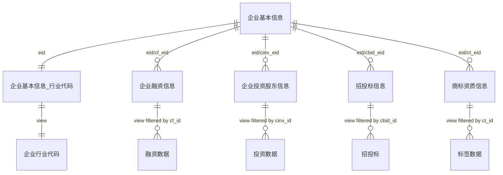

# 智能制造数据库 znjz - Text2SQL Schema 知识库

生成时间：2026-07-05 22:44:12（Asia/Singapore）

## 1. 数据库连接与总体说明

- 数据库类型：MySQL 8.0
- Host：`8.134.9.77`
- Port：`3306`
- Database：`znjz`
- Charset/Collation：`utf8mb4` / `utf8mb4_unicode_ci`
- 用户名：`znjz`
- 说明：密码不要写入知识库，请在工作流的数据库连接配置中单独维护。
- 本库为智能制造企业分析数据集，核心企业主键是 `eid`。

### 导入状态校验

| 对象 | 类型 | 行数/有效事件数 | 关键校验 |
|---|---:|---:|---|
| `企业基本信息` | BASE TABLE | 17,576 | distinct eid=17576 |
| `企业基本信息_行业代码` | BASE TABLE | 17,576 | distinct eid=17576，industry_code非空=17557 |
| `企业融资信息` | BASE TABLE | 17,719 | cf_id非空=267，distinct cf_id=267 |
| `企业投资股东信息` | BASE TABLE | 21,980 | cinv_id非空=6757，distinct cinv_id=6412 |
| `招投标信息` | BASE TABLE | 590,523 | cbid_id非空=576690，distinct cbid_id=576690 |
| `商标资质信息` | BASE TABLE | 30,588 | ct_id非空=14486，distinct ct_id=14486 |
| `企业行业代码` | VIEW | 17,576 | 兼容旧工作流视图：从 企业基本信息_行业代码 取 eid、name、industry_code。 |
| `融资数据` | VIEW | 267 | 兼容旧工作流视图：仅保留 cf_id 非空融资事件，字段简化为融资分析常用口径。 |
| `投资数据` | VIEW | 6,757 | 兼容旧工作流视图：仅保留 cinv_id 非空投资记录，字段简化为投资网络分析常用口径。 |
| `招投标` | VIEW | 576,690 | 兼容旧工作流视图：仅保留 cbid_id 非空招投标记录，并映射 cbid_eid 为 eid。 |
| `标签数据` | VIEW | 14,486 | 兼容旧工作流视图：仅保留 ct_id 非空资质标签记录，并将 ct_* 字段映射为旧标签字段名。 |

## 2. Text2SQL 必须遵守的查询规则

1. 所有中文表名、中文视图名和特殊字段名必须使用反引号，例如 `企业基本信息`、`企业基本信息_行业代码`、`round`。
2. 企业主体关联统一优先使用 `eid`。企业主表是 `企业基本信息`，其他表通过 `eid`、`cf_eid`、`cinv_eid`、`cbid_eid`、`ct_eid` 关联。
3. 宽表中包含“无事件企业”的占位行：融资分析必须过滤 `cf_id IS NOT NULL`，投资分析必须过滤 `cinv_id IS NOT NULL`，招投标分析必须过滤 `cbid_id IS NOT NULL`，资质标签分析必须过滤 `ct_id IS NOT NULL`。
4. 若要兼容旧工作流或减少过滤错误，优先使用兼容视图：`融资数据`、`投资数据`、`招投标`、`标签数据`、`企业行业代码`。这些视图已自动过滤真实事件行或映射旧字段名。
5. 地区过滤优先使用企业登记地区 `企业基本信息.district_code`；招投标项目发生地可使用 `招投标信息.area_code`；资质标签地区可使用 `商标资质信息.ct_district_code`。
6. 行业分析使用 `企业基本信息_行业代码.industry_code` 或视图 `企业行业代码.industry_code`。行业代码示例：`I6531`。
7. 时间趋势：企业成立用 `start_date`，融资用 `round_date` 或 `publish_date`，招投标用 `publish_time`，资质标签用 `ct_year` 或 `ct_publish_date`。
8. 金额字段包括 `regist_capi_new`、`amount`、`estimated_amount`、`project_bid_money`、`should_capi_conv`、`real_capi`。不同表金额单位来自源数据，跨表汇总前必须说明口径。
9. 不要一次性 `SELECT *` 拉全表。回答分析问题时应在 SQL 端使用 `COUNT`、`SUM`、`AVG`、`GROUP BY`、`ORDER BY`、`LIMIT` 聚合。
10. 当前库未导入行政区划代码表和行业代码名称表。若问题要求中文地区/行业名称，应结合工作流外部知识库或单独码表做转义；数据库内可先返回代码。

## 3. 核心关系



### 关联校验结果

| 关联 | 匹配行数 | 说明 |
|---|---:|---|
| `企业基本信息_行业代码.eid = 企业基本信息.eid` | 17,576 | 行业表企业全部匹配主表 |
| `融资数据.eid = 企业基本信息.eid` | 267 | 有效融资事件全部匹配主表 |
| `投资数据.eid = 企业基本信息.eid` | 6,757 | 投资主体全部匹配主表 |
| `招投标.eid = 企业基本信息.eid` | 576,690 | 有效招投标记录全部匹配主表 |
| `标签数据.eid = 企业基本信息.eid` | 14,486 | 有效资质标签记录全部匹配主表 |

## 4. 基础表详细 Schema

### 4.1 `企业基本信息`

- 描述：企业主体主表。一行代表一个企业实体，是所有分析的起点和维表。
- 粒度：一行一个企业 eid。
- 来源文件：`znjz_gzldata_step1.xls`
- 行数：17,576；字段数：39
- 关键字段画像：eid非空=17,576，distinct=17,576，duplicates=0

| Column | MySQL Type | Role | Nullable | Key | Null Rate | Distinct | Example Values | Description |
|---|---|---|---|---|---:|---:|---|---|
| `import_id` | `bigint` | Identifier | NO | PRI |  |  |  | 导入后生成的自增主键；仅用于数据库内部唯一定位，不是业务主键。 |
| `id` | `bigint` | Identifier | YES |  | 0.00% | 17569 | `16630`, `25598`, `29292` | 源数据中的企业或记录编号；在企业主表中为企业源编号，在兼容视图中可能映射为事件/投资/资质记录编号。 |
| `eid` | `varchar(64)` | Identifier | YES | UNI | 0.00% | 17576 | `075362e0-97c7-4003-bc6e-36ae39192ef3`, `08e83696-41d6-4c37-8018-43809b1160fe`, `0a423e4b-2dc6-4069-9fff-746a8cde8fd5` | 企业唯一标识符 UUID，是跨表关联企业实体的首选业务键。 |
| `name` | `varchar(255)` | Text | YES | MUL | 0.00% | 17502 | `广州市璟萌科技有限公司`, `佛山市华太热能科技有限公司`, `广东中伟机电工程有限公司` | 企业名称；在事件表中通常为关联企业名称。 |
| `format_name` | `varchar(255)` | Text | YES |  | 0.00% | 17486 | `广州市璟萌科技有限公司`, `佛山市华太热能科技有限公司`, `广东中伟机电工程有限公司` | 标准化/格式化后的企业名称。 |
| `credit_no` | `varchar(64)` | Text | YES |  | 0.03% | 17570 | `91440101MA59R0DP9T`, `914406043042796882`, `91442000282133900X` | 统一社会信用代码。 |
| `reg_no` | `varchar(64)` | Text | YES |  | 0.05% | 17567 | `440110000358281`, `440602000363534`, `442000000272304` | 工商注册号。 |
| `org_no` | `varchar(64)` | Text | YES |  | 0.14% | 17552 | `MA59R0DP9`, `304279688`, `282133900` | 组织机构代码。 |
| `status` | `varchar(64)` | Dimension | YES | MUL | 0.00% | 10 | `存续（在营、开业、在册）`, `存续（在营、开业、在册）`, `存续（在营、开业、在册）` | 企业经营状态中文文本，如存续、注销、吊销等。 |
| `new_status_code` | `bigint` | Dimension | YES |  | 0.00% | 6 | `1`, `1`, `1` | 企业经营状态标准化代码。 |
| `type_new` | `double` | Text | YES |  | 0.01% | 2 | `1.0`, `1.0`, `1.0` | 企业类型代码。 |
| `category_new` | `double` | Text | YES |  | 0.01% | 2 | `115601.0`, `115601.0`, `115601.0` | 企业类别代码。 |
| `regist_capi` | `varchar(128)` | Text | YES |  | 0.10% | 925 | `104万元人民币`, `600万元人民币`, `1000万元人民币` | 注册资本原始文本，带单位或币种表达。 |
| `regist_capi_new` | `double` | Metric | YES |  | 0.10% | 902 | `104.0`, `600.0`, `1000.0` | 注册资本数值化字段，适合排序、分组和区间统计。 |
| `actual_capi` | `double` | Metric | YES |  | 69.40% | 1318 | `0.0`, `16.0`, `955.0` | 实缴资本/实际资本数值。 |
| `currency_unit` | `varchar(32)` | Dimension | YES |  | 0.10% | 5 | `CNY`, `CNY`, `CNY` | 注册资本币种或计价单位。 |
| `start_date` | `datetime` | Temporal | YES | MUL | 0.00% | 3834 | `2017-07-26`, `2014-08-08`, `1996-02-15` | 企业成立日期/注册成立日期。 |
| `check_date` | `datetime` | Temporal | YES |  | 0.12% | 1970 | `2017-07-26`, `2024-07-16`, `2024-11-22` | 工商核准或信息核验日期，适合判断登记信息时效。 |
| `term_start` | `varchar(64)` | Text | YES |  | 0.38% | 3828 | `2017-07-26`, `2014-08-08`, `1996-02-15` | 经营期限起始文本。 |
| `term_end` | `varchar(64)` | Text | YES |  | 97.16% | 155 | `2033-09-18`, `5000-01-01`, `5000-01-01` | 经营期限结束文本，可能为长期/无固定期限。 |
| `belong_org` | `varchar(255)` | Text | YES |  | 0.18% | 226 | `广州市南沙区市场监督管理局`, `佛山市禅城区市场监督管理局`, `中山市市场监督管理局` | 登记机关/所属工商管理机关。 |
| `province_code` | `varchar(12)` | Dimension | YES |  | 0.00% | 3 | `440000`, `440000`, `440000` | 省级行政区划代码。 |
| `district_code` | `varchar(12)` | Dimension | YES | MUL | 0.00% | 133 | `440115`, `440604`, `442000` | 兼容视图中的地区代码字段；企业主表中表示企业登记地区。 |
| `oper_name` | `varchar(128)` | Text | YES |  | 0.10% | 15717 | `武保中`, `刘加方`, `胡振华` | 法定代表人/负责人姓名。 |
| `oper_type` | `varchar(64)` | Dimension | YES |  | 0.11% | 3 | `P`, `P`, `P` | 负责人类型。 |
| `oper_name_id` | `varchar(128)` | Identifier | YES |  | 0.47% | 16560 | `66a87b761eba8753da0cb58d8d90890b`, `a57ad65ee23f75c41f95c3b1355c1d8b`, `b76fc215e3aff9fa383d52b9805d8f4b` | 负责人关联标识。 |
| `scope` | `text` | Text | YES |  | 0.11% | 16937 | `电影和影视节目制作；音像制品制作；电影和影视节目发行；为医务人员提供医疗执业、职业发展等人力资源服务；组织医务人员在合法`, `一般项目：机械设备研发；矿山机械销售；液压动力机械及元件销售；气压动力机械及元件销售；机械零件、零部件销售；建筑工程用机`, `许可项目：建设工程施工；电气安装服务；特种设备安装改造修理；输电、供电、受电电力设施的安装、维修和试验；建设工程设计；建` | 企业经营范围长文本，是判断业务方向和智能制造相关关键词的重要文本字段。 |
| `collegues_num` | `varchar(64)` | Text | YES |  | 99.16% | 36 | `5人`, `1人`, `1人` | 从业人员/参保人数等规模文本字段；口径以源数据为准。 |
| `logo_url` | `text` | Text | YES |  | 94.90% | 861 | `https://qxb-logo-url.oss-cn-hangzhou.aliyuncs.com/OriginalUr`, `https://qxb-logo-url.oss-cn-hangzhou.aliyuncs.com/OriginalUr`, `https://qxb-logo-url.oss-cn-hangzhou.aliyuncs.com/OriginalUr` | 企业 Logo 链接。 |
| `url` | `text` | Text | YES |  | 99.91% | 2 | `https://www.e-services.cr.gov.hk/ICRIS3EP/system/dashboard/e`, `https://www.e-services.cr.gov.hk/ICRIS3EP/system/dashboard/e`, `https://www.icris.cr.gov.hk/csci/cps_criteria.do` | 企业官网或相关网页链接。 |
| `econ_kind` | `varchar(128)` | Dimension | YES |  | 0.01% | 40 | `有限责任公司（自然人投资或控股）`, `有限责任公司（自然人投资或控股）`, `有限责任公司（自然人投资或控股）` | 经济性质/企业经济类型中文文本。 |
| `econ_kind_code` | `varchar(32)` | Dimension | YES |  | 0.11% | 30 | `1130.0`, `1130.0`, `1130.0` | 经济性质/企业经济类型代码。 |
| `title_code` | `varchar(64)` | Dimension | YES |  | 0.07% | 3 | `999A`, `999A`, `999A` | 企业称谓/头衔相关代码。 |
| `revoke_date` | `datetime` | Temporal | YES |  | 99.99% | 1 | `2001-07-20` | 吊销日期。 |
| `revoke_reason` | `text` | Text | YES |  | 99.99% | 1 | `不按照规定接受年度检验的，依法吊销营业执照。` | 吊销原因。 |
| `logout_date` | `datetime` | Temporal | YES |  | 99.57% | 75 | `2020-03-05`, `2024-05-27`, `2019-02-01` | 注销日期。 |
| `logout_reason` | `text` | Text | YES |  | 99.70% | 3 | `经营期限届满`, `决议解散`, `决议解散` | 注销原因。 |
| `revoked_certificates` | `double` | Text | YES |  | 100.00% | 0 |  | 证照吊销/撤销相关标识或数量字段。 |
| `created_time` | `datetime` | Temporal | YES |  | 0.00% | 17569 | `1501205774705`, `1524314518190`, `1512067321061` | 源数据记录创建时间，导入时已由毫秒时间戳转换为 DATETIME。 |
| `row_update_time` | `datetime` | Temporal | YES |  | 0.00% | 17520 | `2026-03-31T20:02:58`, `2026-03-22T02:51:14`, `2026-03-22T10:43:25` | 源数据行更新时间。 |

### 4.2 `企业基本信息_行业代码`

- 描述：企业主体与行业代码表。一行代表一个企业当前行业分类记录，并保留企业基础字段。
- 粒度：一行一个企业 eid 对应的行业分类。
- 来源文件：`znjz_gzldata_step2.xlsx`
- 行数：17,576；字段数：42
- 关键字段画像：eid非空=17,576，distinct=17,576，duplicates=0

| Column | MySQL Type | Role | Nullable | Key | Null Rate | Distinct | Example Values | Description |
|---|---|---|---|---|---:|---:|---|---|
| `import_id` | `bigint` | Identifier | NO | PRI |  |  |  | 导入后生成的自增主键；仅用于数据库内部唯一定位，不是业务主键。 |
| `id` | `bigint` | Identifier | YES |  | 0.00% | 17569 | `1756`, `2684`, `8089` | 源数据中的企业或记录编号；在企业主表中为企业源编号，在兼容视图中可能映射为事件/投资/资质记录编号。 |
| `eid` | `varchar(64)` | Identifier | YES | UNI | 0.00% | 17576 | `00d8d876-78f3-4d53-bb15-6c68871f851d`, `014b9528-ec54-44fa-8a3e-e41560343457`, `0334fbee-b740-47d5-a88b-b82f77a17bab` | 企业唯一标识符 UUID，是跨表关联企业实体的首选业务键。 |
| `name` | `varchar(255)` | Text | YES |  | 0.00% | 17502 | `广州恒通智联科技有限公司`, `广州维尔互联网科技有限公司`, `深圳聚惠智能停车有限公司` | 企业名称；在事件表中通常为关联企业名称。 |
| `format_name` | `varchar(255)` | Text | YES |  | 0.00% | 17486 | `广州恒通智联科技有限公司`, `广州维尔互联网科技有限公司`, `深圳聚惠智能停车有限公司` | 标准化/格式化后的企业名称。 |
| `credit_no` | `varchar(64)` | Text | YES |  | 0.03% | 17570 | `91440106562277212W`, `91440101MA5ATAH177`, `91440300335351689H` | 统一社会信用代码。 |
| `reg_no` | `varchar(64)` | Text | YES |  | 0.05% | 17567 | `440106000313848`, `440126001080384`, `440301112805630` | 工商注册号。 |
| `org_no` | `varchar(64)` | Text | YES |  | 0.14% | 17552 | `562277212`, `MA5ATAH17`, `335351689` | 组织机构代码。 |
| `status` | `varchar(64)` | Dimension | YES |  | 0.00% | 10 | `存续（在营、开业、在册）`, `存续（在营、开业、在册）`, `存续（在营、开业、在册）` | 企业经营状态中文文本，如存续、注销、吊销等。 |
| `new_status_code` | `bigint` | Dimension | YES |  | 0.00% | 6 | `1`, `1`, `1` | 企业经营状态标准化代码。 |
| `type_new` | `double` | Text | YES |  | 0.01% | 2 | `1.0`, `1.0`, `1.0` | 企业类型代码。 |
| `category_new` | `double` | Text | YES |  | 0.01% | 2 | `115601.0`, `115601.0`, `115601.0` | 企业类别代码。 |
| `regist_capi` | `varchar(128)` | Text | YES |  | 0.10% | 925 | `1000万元人民币`, `50万元人民币`, `20万元人民币` | 注册资本原始文本，带单位或币种表达。 |
| `regist_capi_new` | `double` | Metric | YES |  | 0.10% | 902 | `1000.0`, `50.0`, `20.0` | 注册资本数值化字段，适合排序、分组和区间统计。 |
| `actual_capi` | `double` | Metric | YES |  | 69.40% | 1318 | `400.0`, `770.0`, `40588.24` | 实缴资本/实际资本数值。 |
| `currency_unit` | `varchar(32)` | Dimension | YES |  | 0.10% | 5 | `CNY`, `CNY`, `CNY` | 注册资本币种或计价单位。 |
| `start_date` | `datetime` | Temporal | YES | MUL | 0.00% | 3834 | `2010-09-26`, `2018-04-16`, `2015-05-07` | 企业成立日期/注册成立日期。 |
| `check_date` | `datetime` | Temporal | YES |  | 0.12% | 1970 | `2025-11-25`, `2025-08-22`, `2025-08-04` | 工商核准或信息核验日期，适合判断登记信息时效。 |
| `term_start` | `varchar(64)` | Text | YES |  | 0.38% | 3828 | `2010-09-26`, `2018-04-16`, `2015-05-07` | 经营期限起始文本。 |
| `term_end` | `varchar(64)` | Text | YES |  | 97.16% | 155 | `5000-01-01`, `5000-01-01`, `2039-01-23` | 经营期限结束文本，可能为长期/无固定期限。 |
| `belong_org` | `varchar(255)` | Text | YES |  | 0.18% | 226 | `广州市黄埔区市场监督管理局`, `广州市天河区市场监督管理局`, `深圳市市场监督管理局` | 登记机关/所属工商管理机关。 |
| `province_code` | `varchar(12)` | Dimension | YES |  | 0.00% | 3 | `440000`, `440000`, `440000` | 省级行政区划代码。 |
| `district_code` | `varchar(12)` | Dimension | YES | MUL | 0.00% | 133 | `440112`, `440106`, `440309` | 兼容视图中的地区代码字段；企业主表中表示企业登记地区。 |
| `oper_name` | `varchar(128)` | Text | YES |  | 0.10% | 15717 | `陈建新`, `施胜楚`, `何蓉` | 法定代表人/负责人姓名。 |
| `oper_type` | `varchar(64)` | Dimension | YES |  | 0.11% | 3 | `P`, `P`, `P` | 负责人类型。 |
| `oper_name_id` | `varchar(128)` | Identifier | YES |  | 0.47% | 16560 | `018c9e4344fd7bf572ac1c695d8e6679`, `8523760047b12360be635a3f9d6363e0`, `06e2fdb37a7438a116746cf0eac453ad` | 负责人关联标识。 |
| `scope` | `text` | Text | YES |  | 0.11% | 16937 | `智能水务系统开发；人工智能公共数据平台；人工智能公共服务平台技术咨询服务；人工智能基础软件开发；水资源管理；水文服务；水`, `数据处理和存储服务；信息技术咨询服务；计算机房维护服务；信息系统集成服务；软件开发；计算机技术开发、技术服务；软件技术推`, `国内贸易，货物及技术的进出口。智能机器人销售；工业机器人销售；工业机器人安装、维修；智能机器人的研发；新能源汽车换电设施` | 企业经营范围长文本，是判断业务方向和智能制造相关关键词的重要文本字段。 |
| `collegues_num` | `varchar(64)` | Text | YES |  | 99.16% | 36 | `60人`, `3人`, `1人` | 从业人员/参保人数等规模文本字段；口径以源数据为准。 |
| `logo_url` | `text` | Text | YES |  | 94.90% | 861 | `https://qxb-logo-url.oss-cn-hangzhou.aliyuncs.com/OriginalUr`, `https://qxb-logo-url.oss-cn-hangzhou.aliyuncs.com/OriginalUr`, `https://qxb-logo-url.oss-cn-hangzhou.aliyuncs.com/OriginalUr` | 企业 Logo 链接。 |
| `url` | `text` | Text | YES |  | 99.91% | 2 | `https://www.e-services.cr.gov.hk/ICRIS3EP/system/dashboard/e`, `https://www.e-services.cr.gov.hk/ICRIS3EP/system/dashboard/e`, `https://www.e-services.cr.gov.hk/ICRIS3EP/system/dashboard/e` | 企业官网或相关网页链接。 |
| `econ_kind` | `varchar(128)` | Dimension | YES |  | 0.01% | 40 | `有限责任公司（自然人投资或控股）`, `有限责任公司（外商投资企业与内资合资）`, `有限责任公司` | 经济性质/企业经济类型中文文本。 |
| `econ_kind_code` | `varchar(32)` | Dimension | YES |  | 0.11% | 30 | `1130.0`, `1122.0`, `1100.0` | 经济性质/企业经济类型代码。 |
| `title_code` | `varchar(64)` | Dimension | YES |  | 0.07% | 3 | `999A`, `999A`, `999A` | 企业称谓/头衔相关代码。 |
| `revoke_date` | `datetime` | Temporal | YES |  | 99.99% | 1 | `2001-07-20` | 吊销日期。 |
| `revoke_reason` | `text` | Text | YES |  | 99.99% | 1 | `不按照规定接受年度检验的，依法吊销营业执照。` | 吊销原因。 |
| `logout_date` | `datetime` | Temporal | YES |  | 99.57% | 75 | `2022-01-17`, `2021-11-12`, `2015-07-31` | 注销日期。 |
| `logout_reason` | `text` | Text | YES |  | 99.70% | 3 | `决议解散`, `其他原因`, `决议解散` | 注销原因。 |
| `revoked_certificates` | `double` | Text | YES |  | 100.00% | 0 |  | 证照吊销/撤销相关标识或数量字段。 |
| `created_time` | `datetime` | Temporal | YES |  | 0.00% | 17569 | `1524297267014`, `1524016998356`, `1524401196106` | 源数据记录创建时间，导入时已由毫秒时间戳转换为 DATETIME。 |
| `row_update_time` | `datetime` | Temporal | YES |  | 0.00% | 17520 | `2026-01-15T17:36:24`, `2025-08-27T07:24:13`, `2025-08-29T19:26:24` | 源数据行更新时间。 |
| `industry_code` | `varchar(16)` | Dimension | YES | MUL | 0.11% | 175 | `I6531`, `I6510`, `E5011` | 国民经济行业代码，如 I6531；用于产业分类、主导产业识别和行业聚合。 |
| `ci_start_date` | `datetime` | Temporal | YES |  | 89.88% | 37 | `2023-03-08`, `2023-03-08`, `2023-03-08` | 企业行业代码关系开始日期。 |
| `ci_create_time` | `datetime` | Temporal | YES |  | 0.11% | 17557 | `1678231865070.0`, `1678216924646.0`, `1731280768049.0` | 企业行业代码记录创建时间，导入时已由毫秒时间戳转换为 DATETIME。 |

### 4.3 `企业融资信息`

- 描述：企业融资事实表的宽表。包含全部企业基础行；只有 cf_id 非空的行是真实融资事件。
- 粒度：左连接宽表：一行一个企业或一个融资事件；分析事件时过滤 cf_id IS NOT NULL。
- 来源文件：`znjz_gzldata_step3.xlsx`
- 行数：17,719；字段数：56
- 关键字段画像：eid非空=17,719，distinct=17,576，duplicates=143；cf_id非空=267，distinct=267，duplicates=0

| Column | MySQL Type | Role | Nullable | Key | Null Rate | Distinct | Example Values | Description |
|---|---|---|---|---|---:|---:|---|---|
| `import_id` | `bigint` | Identifier | NO | PRI |  |  |  | 导入后生成的自增主键；仅用于数据库内部唯一定位，不是业务主键。 |
| `id` | `bigint` | Identifier | YES |  | 0.00% | 17569 | `6027`, `8371`, `11690` | 源数据中的企业或记录编号；在企业主表中为企业源编号，在兼容视图中可能映射为事件/投资/资质记录编号。 |
| `eid` | `varchar(64)` | Identifier | YES | MUL | 0.00% | 17576 | `024345b6-d093-429d-b0c3-91440d3d4c8d`, `032309f6-1775-433a-93f5-7a53ea0d6b07`, `05027db0-16f7-4cb0-b783-57360d8d95d0` | 企业唯一标识符 UUID，是跨表关联企业实体的首选业务键。 |
| `name` | `varchar(255)` | Text | YES |  | 0.00% | 17502 | `广州敏高信息科技有限公司`, `湛江市霞山区吉星电脑有限公司`, `广州正想科技有限责任公司` | 企业名称；在事件表中通常为关联企业名称。 |
| `format_name` | `varchar(255)` | Text | YES |  | 0.00% | 17486 | `广州敏高信息科技有限公司`, `湛江市霞山区吉星电脑有限公司`, `广州正想科技有限责任公司` | 标准化/格式化后的企业名称。 |
| `credit_no` | `varchar(64)` | Text | YES |  | 0.03% | 17570 | `91440101MA59RD5RXB`, `914408007762269553`, `914401047619094893` | 统一社会信用代码。 |
| `reg_no` | `varchar(64)` | Text | YES |  | 0.05% | 17567 | `440106002122682`, `440800000048876`, `440104000092297` | 工商注册号。 |
| `org_no` | `varchar(64)` | Text | YES |  | 0.14% | 17552 | `MA59RD5RX`, `776226955`, `761909489` | 组织机构代码。 |
| `status` | `varchar(64)` | Dimension | YES |  | 0.00% | 10 | `存续（在营、开业、在册）`, `存续（在营、开业、在册）`, `存续（在营、开业、在册）` | 企业经营状态中文文本，如存续、注销、吊销等。 |
| `new_status_code` | `bigint` | Dimension | YES |  | 0.00% | 6 | `1`, `1`, `1` | 企业经营状态标准化代码。 |
| `type_new` | `double` | Text | YES |  | 0.01% | 2 | `1.0`, `1.0`, `1.0` | 企业类型代码。 |
| `category_new` | `double` | Text | YES |  | 0.01% | 2 | `115601.0`, `115601.0`, `115601.0` | 企业类别代码。 |
| `regist_capi` | `varchar(128)` | Text | YES |  | 0.10% | 925 | `1009万元人民币`, `50万元人民币`, `1000万元人民币` | 注册资本原始文本，带单位或币种表达。 |
| `regist_capi_new` | `double` | Metric | YES |  | 0.10% | 902 | `1009.0`, `50.0`, `1000.0` | 注册资本数值化字段，适合排序、分组和区间统计。 |
| `actual_capi` | `double` | Metric | YES |  | 68.84% | 1318 | `50.0`, `1000.0`, `80.0` | 实缴资本/实际资本数值。 |
| `currency_unit` | `varchar(32)` | Dimension | YES |  | 0.10% | 5 | `CNY`, `CNY`, `CNY` | 注册资本币种或计价单位。 |
| `start_date` | `datetime` | Temporal | YES |  | 0.00% | 3834 | `2017-08-04`, `2005-06-13`, `2004-04-16` | 企业成立日期/注册成立日期。 |
| `check_date` | `datetime` | Temporal | YES |  | 0.12% | 1970 | `2025-11-11`, `2025-10-28`, `2024-07-29` | 工商核准或信息核验日期，适合判断登记信息时效。 |
| `term_start` | `varchar(64)` | Text | YES |  | 0.38% | 3828 | `2017-08-04`, `2005-06-13`, `2004-04-16` | 经营期限起始文本。 |
| `term_end` | `varchar(64)` | Text | YES |  | 96.99% | 155 | `2039-03-23`, `5000-01-01`, `5000-01-01` | 经营期限结束文本，可能为长期/无固定期限。 |
| `belong_org` | `varchar(255)` | Text | YES |  | 0.18% | 226 | `广州市天河区市场监督管理局`, `湛江市市场监督管理局`, `广州市越秀区市场监督管理局` | 登记机关/所属工商管理机关。 |
| `province_code` | `varchar(12)` | Dimension | YES |  | 0.00% | 3 | `440000`, `440000`, `440000` | 省级行政区划代码。 |
| `district_code` | `varchar(12)` | Dimension | YES |  | 0.00% | 133 | `440106`, `440803`, `440104` | 兼容视图中的地区代码字段；企业主表中表示企业登记地区。 |
| `oper_name` | `varchar(128)` | Text | YES |  | 0.10% | 15717 | `肖爱枚`, `陈金龙`, `郑泉生` | 法定代表人/负责人姓名。 |
| `oper_type` | `varchar(64)` | Dimension | YES |  | 0.11% | 3 | `P`, `P`, `P` | 负责人类型。 |
| `oper_name_id` | `varchar(128)` | Identifier | YES |  | 0.46% | 16560 | `8ba6de1206750f1cdd3701c41930ad6a`, `819d2e02b6c7ac9a7cd952b02a81b1e5`, `158fa03143806151b4d7f3a9394ff325` | 负责人关联标识。 |
| `scope` | `text` | Text | YES |  | 0.11% | 16937 | `第一类医疗器械销售；第一类医疗器械租赁；第二类医疗设备租赁；第二类医疗器械销售；网络与信息安全软件开发；智能输配电及控制`, `一般项目：计算机软硬件及辅助设备批发；计算机软硬件及辅助设备零售；电子产品销售；家居用品销售；云计算设备销售；光通信设备`, `未经加工的坚果、干果销售；广告制作；金属矿石销售；非金属矿及制品销售；耐火材料销售；食用农产品批发；农副产品销售；食品进` | 企业经营范围长文本，是判断业务方向和智能制造相关关键词的重要文本字段。 |
| `collegues_num` | `varchar(64)` | Text | YES |  | 99.15% | 36 | `6人`, `52人`, `2人` | 从业人员/参保人数等规模文本字段；口径以源数据为准。 |
| `logo_url` | `text` | Text | YES |  | 94.23% | 861 | `https://qxb-logo-url.oss-cn-hangzhou.aliyuncs.com/OriginalUr`, `https://qxb-logo-url.oss-cn-hangzhou.aliyuncs.com/OriginalUr`, `https://qxb-logo-url.oss-cn-hangzhou.aliyuncs.com/OriginalUr` | 企业 Logo 链接。 |
| `url` | `text` | Text | YES |  | 99.92% | 2 | `https://www.icris.cr.gov.hk/csci/cps_criteria.do`, `https://www.e-services.cr.gov.hk/ICRIS3EP/system/dashboard/e`, `https://www.e-services.cr.gov.hk/ICRIS3EP/system/dashboard/e` | 企业官网或相关网页链接。 |
| `econ_kind` | `varchar(128)` | Dimension | YES |  | 0.01% | 40 | `有限责任公司（自然人独资）`, `有限责任公司（自然人投资或控股）`, `有限责任公司（自然人投资或控股）` | 经济性质/企业经济类型中文文本。 |
| `econ_kind_code` | `varchar(32)` | Dimension | YES |  | 0.11% | 30 | `1151.0`, `1130.0`, `1130.0` | 经济性质/企业经济类型代码。 |
| `title_code` | `varchar(64)` | Dimension | YES |  | 0.07% | 3 | `999A`, `999A`, `999A` | 企业称谓/头衔相关代码。 |
| `revoke_date` | `datetime` | Temporal | YES |  | 99.99% | 1 | `2001-07-20` | 吊销日期。 |
| `revoke_reason` | `text` | Text | YES |  | 99.99% | 1 | `不按照规定接受年度检验的，依法吊销营业执照。` | 吊销原因。 |
| `logout_date` | `datetime` | Temporal | YES |  | 99.57% | 75 | `2022-12-19`, `2019-04-22`, `2016-11-25` | 注销日期。 |
| `logout_reason` | `text` | Text | YES |  | 99.71% | 3 | `决议解散`, `决议解散`, `决议解散` | 注销原因。 |
| `revoked_certificates` | `double` | Text | YES |  | 100.00% | 0 |  | 证照吊销/撤销相关标识或数量字段。 |
| `created_time` | `datetime` | Temporal | YES |  | 0.00% | 17569 | `1502071890289`, `1524377751436`, `1513399162241` | 源数据记录创建时间，导入时已由毫秒时间戳转换为 DATETIME。 |
| `row_update_time` | `datetime` | Temporal | YES |  | 0.00% | 17520 | `2025-11-12T08:41:59`, `2025-10-31T07:44:57`, `2025-08-30T00:14:56` | 源数据行更新时间。 |
| `cf_id` | `bigint` | Identifier | YES | MUL | 98.49% | 267 | `67861.0`, `231072.0`, `98328.0` | 融资事件唯一编号；为空表示该企业在左连接结果中无融资事件。 |
| `cf_eid` | `varchar(64)` | Identifier | YES | MUL | 98.49% | 124 | `254ea87b-3127-4508-b69e-e1b20d700193`, `5aa19431-5394-4705-8f63-e4f9e1e75dae`, `5f816bf2-e0c1-4479-a58d-0f9a6f9a80e5` | 融资事件关联企业 eid。 |
| `ename` | `varchar(255)` | Text | YES |  | 98.49% | 124 | `深圳截明电子科技有限公司`, `中科君胜（深圳）智能数据科技发展有限公司`, `广州市坤腾软件技术有限公司` | 融资事件中的企业名称。 |
| `round` | `varchar(64)` | Dimension | YES | MUL | 98.49% | 18 | `天使轮`, `股权投资`, `被收购` | 融资轮次中文名称，如天使轮、A轮、股权投资等。 |
| `round_type` | `double` | Dimension | YES |  | 98.49% | 18 | `1011.0`, `0.0`, `1120.0` | 融资轮次类型代码。 |
| `round_date` | `datetime` | Temporal | YES | MUL | 98.49% | 252 | `2019-01-23`, `2017-08-30`, `2017-09-29` | 融资发生日期。 |
| `amount` | `decimal(20,2)` | Metric | YES |  | 99.38% | 55 | `9500000.0`, `100000000.0`, `10000000.0` | 融资金额数值；需与 currency 同时使用。 |
| `currency` | `varchar(16)` | Dimension | YES |  | 98.86% | 2 | `CNY`, `CNY`, `CNY` | 融资金额币种。 |
| `investors` | `text` | Text | YES |  | 98.73% | 221 | `朗科投资，启赋资本`, `中自投资`, `创显科教` | 投资方文本。 |
| `investors_json` | `longtext` | Text | YES |  | 98.49% | 219 | `[{"text": "朗科投资", "type": "investor", "id": 9339}, {"text": `, `[{"id": 17726, "text": "中自投资", "type": "investor"}]`, `[{"text": "创显科教", "type": "investor", "id": 21100}]` | 投资方结构化 JSON 文本。 |
| `precise` | `double` | Text | YES |  | 98.49% | 2 | `0.0`, `0.0`, `0.0` | 融资金额是否精确的标识字段。 |
| `estimated_amount` | `decimal(20,2)` | Metric | YES |  | 98.49% | 93 | `15812500.0`, `0.0`, `9500000.0` | 估算融资金额。 |
| `pre_money` | `decimal(20,2)` | Metric | YES |  | 100.00% | 0 |  | 投前估值。 |
| `post_money` | `decimal(20,2)` | Metric | YES |  | 99.92% | 15 | `3200000.0`, `4265000000.0`, `20000000000.0` | 投后估值。 |
| `publish_date` | `datetime` | Temporal | YES |  | 98.56% | 242 | `2017-08-30`, `2017-09-29`, `2020-09-28` | 融资新闻或公告发布日期。 |
| `newstitle` | `text` | Text | YES |  | 99.54% | 79 | `惠尔智能完成Pre`, `完成数千万元A轮融资，「惠尔智能」自研L4级无人小车、已获大笔海外订单 \| 硬氪首发`, `深圳取袋机企业【立袋环保】获800万天使轮融资！` | 融资新闻标题。 |
| `newslink` | `text` | Text | YES |  | 99.51% | 85 | `https://www.sohu.com/a/526775021_121319482`, `https://36kr.com/p/2808545791035656`, `http://www.chinapaper.net/news/show-61894.html` | 融资新闻链接。 |

### 4.4 `企业投资股东信息`

- 描述：企业对外投资/股权投资事实表。只有 cinv_id 非空的行是真实投资记录。
- 粒度：左连接宽表：一行一个企业或一个投资记录；分析投资时过滤 cinv_id IS NOT NULL。
- 来源文件：`znjz_gzldata_step4.xlsx`
- 行数：21,980；字段数：24
- 关键字段画像：cinv_id非空=6,757，distinct=6,412，duplicates=345

| Column | MySQL Type | Role | Nullable | Key | Null Rate | Distinct | Example Values | Description |
|---|---|---|---|---|---:|---:|---|---|
| `import_id` | `bigint` | Identifier | NO | PRI |  |  |  | 导入后生成的自增主键；仅用于数据库内部唯一定位，不是业务主键。 |
| `name` | `varchar(255)` | Text | YES | MUL | 0.00% | 17502 | `万商通（广州）电子商务科技有限公司`, `万商通（广州）电子商务科技有限公司`, `万商通（广州）电子商务科技有限公司` | 企业名称；在事件表中通常为关联企业名称。 |
| `cinv_id` | `bigint` | Identifier | YES | MUL | 69.26% | 6412 | `46870.0`, `38914.0`, `38937.0` | 对外投资/股权投资记录编号；为空表示无实际投资记录。 |
| `cinv_eid` | `varchar(64)` | Identifier | YES | MUL | 69.26% | 2289 | `8f773b0b-132c-4124-861c-3f584af9f92b`, `8f773b0b-132c-4124-861c-3f584af9f92b`, `8f773b0b-132c-4124-861c-3f584af9f92b` | 投资主体企业 eid，通常对应本库企业基本信息。 |
| `cinv_name` | `varchar(255)` | Text | YES |  | 69.26% | 2294 | `万商通（广州）电子商务科技有限公司`, `万商通（广州）电子商务科技有限公司`, `万商通（广州）电子商务科技有限公司` | 投资主体企业名称。 |
| `invest_eid` | `varchar(64)` | Identifier | YES | MUL | 69.26% | 6664 | `92bef440-99b7-43f3-af48-6ad5d8d69a4d`, `9e4c2671-d387-417f-ac14-4651cc14977e`, `10a4bfe0-aa01-4a73-9ab2-105afd553c2f` | 被投资企业 eid。 |
| `invest_name` | `varchar(255)` | Text | YES |  | 69.26% | 6664 | `寻乌县时空莱福旅游有限责任公司`, `广东高进实业投资有限公司`, `广州市新美燕尔健康管理有限公司` | 被投资企业名称。 |
| `invest_credit_no` | `varchar(64)` | Text | YES |  | 69.48% | 6618 | `91360734MA7CB7MG0R`, `91440113MA9YBMXG5Q`, `91440113MA9YBPPF41` | 被投资企业统一社会信用代码。 |
| `invest_reg_no` | `varchar(64)` | Text | YES |  | 69.48% | 6616 | `360734210037681`, `440126003992902`, `440126003994342` | 被投资企业工商注册号。 |
| `invest_status` | `varchar(64)` | Text | YES |  | 69.26% | 14 | `存续（在营、开业、在册）`, `注销`, `存续（在营、开业、在册）` | 被投资企业经营状态。 |
| `invest_oper_name` | `varchar(128)` | Text | YES |  | 69.28% | 4866 | `邝佩芸`, `唐利枝`, `黄亮` | 被投资企业法定代表人/负责人。 |
| `invest_regist_capi` | `varchar(128)` | Text | YES |  | 69.28% | 684 | `1000万元人民币`, `500万元人民币`, `500万元人民币` | 被投资企业注册资本文本。 |
| `invest_start_date` | `datetime` | Temporal | YES |  | 69.28% | 2781 | `2021-10-29`, `2022-03-10`, `2022-03-11` | 被投资企业成立日期。 |
| `stock_percent` | `decimal(18,8)` | Metric | YES |  | 69.26% | 482 | `0.7`, `0.1`, `0.1` | 持股比例，数值口径为 0-1；展示为百分比时乘以 100。 |
| `should_capi_conv` | `decimal(20,4)` | Metric | YES |  | 69.26% | 990 | `700.0`, `50.0`, `50.0` | 认缴出资额换算值。 |
| `invest_quote_status` | `double` | Text | YES |  | 69.26% | 2 | `0.0`, `0.0`, `0.0` | 被投资企业上市/报价状态代码。 |
| `cinv_belong_org` | `varchar(255)` | Text | YES |  | 69.36% | 942 | `寻乌县市场监督管理局`, `广州市番禺区市场监督管理局`, `广州市番禺区市场监督管理局` | 投资记录登记机关。 |
| `belong_org_code` | `varchar(32)` | Dimension | YES |  | 69.36% | 771 | `360734.0`, `440113.0`, `440113.0` | 登记机关代码。 |
| `stock_num` | `decimal(20,4)` | Metric | YES |  | 69.26% | 10 | `0.0`, `0.0`, `0.0` | 持股数量。 |
| `should_capi` | `decimal(20,4)` | Metric | YES |  | 69.26% | 986 | `700.0`, `50.0`, `50.0` | 认缴出资额原始数值。 |
| `currency_code` | `varchar(16)` | Dimension | YES |  | 70.66% | 5 | `CNY`, `CNY`, `CNY` | 出资币种代码。 |
| `real_capi` | `decimal(20,4)` | Metric | YES |  | 69.26% | 463 | `0.0`, `0.0`, `0.0` | 实缴出资额。 |
| `should_con_date` | `datetime` | Temporal | YES |  | 74.16% | 2253 | `2032-06-15`, `2066-01-01`, `2050-12-31` | 认缴出资日期。 |
| `cinv_is_history` | `double` | Text | YES |  | 69.26% | 2 | `1.0`, `0.0`, `0.0` | 是否历史投资记录标识。 |
| `cinv_u_tags` | `text` | Text | YES |  | 69.26% | 1 | `0.0`, `0.0`, `0.0` | 投资记录标签/扩展标识。 |

### 4.5 `招投标信息`

- 描述：企业招投标事实表。只有 cbid_id 非空的行是真实招投标记录。
- 粒度：左连接宽表：一行一个企业或一个招投标记录；分析项目时过滤 cbid_id IS NOT NULL。
- 来源文件：`znjz_gzldata_step5.xlsx`
- 行数：590,523；字段数：12
- 关键字段画像：cbid_id非空=576,690，distinct=576,690，duplicates=0

| Column | MySQL Type | Role | Nullable | Key | Null Rate | Distinct | Example Values | Description |
|---|---|---|---|---|---:|---:|---|---|
| `import_id` | `bigint` | Identifier | NO | PRI |  |  |  | 导入后生成的自增主键；仅用于数据库内部唯一定位，不是业务主键。 |
| `name` | `varchar(255)` | Text | YES |  | 0.00% | 17502 | `一顺智能科技（广州）有限公司`, `一顺智能科技（广州）有限公司`, `三叶七（中山）科技有限公司` | 企业名称；在事件表中通常为关联企业名称。 |
| `cbid_id` | `bigint` | Identifier | YES | MUL | 2.34% | 576690 | `161043250400.0`, `275289620400.0`, `643897150000.0` | 招投标公告/项目记录编号；为空表示该企业无实际招投标记录。 |
| `cbid_eid` | `varchar(64)` | Identifier | YES | MUL | 2.34% | 3679 | `20d1ff25-8a5c-4a8a-bc99-83de8d12954b`, `20d1ff25-8a5c-4a8a-bc99-83de8d12954b`, `16037550-da10-11ef-9c89-00163f001b09` | 招投标记录关联企业 eid。 |
| `u_id` | `varchar(64)` | Identifier | YES |  | 2.34% | 527538 | `64104aac05b6b1be3e0e06cc`, `672e37be0573ad3388e6255a`, `680d9ddfd59bd3444f657738` | 招投标公告唯一标识。 |
| `role1` | `double` | Text | YES |  | 2.34% | 6 | `30.0`, `30.0`, `30.0` | 企业在招投标中的角色代码。 |
| `title` | `text` | Text | YES |  | 2.34% | 463069 | `中建科工华南区域2022-2024年度智慧工地集采`, `合正龙腾项目弱电工程`, `东莞市厚街镇新塘小学视频会议系统设备（定制化服务）定点采购定点议价成交公告` | 招投标公告标题。 |
| `publish_time` | `datetime` | Temporal | YES | MUL | 2.34% | 5460 | `2022-12-14T00:00:00`, `2020-12-03T00:00:00`, `2025-04-27T00:00:00` | 招投标公告发布时间。 |
| `area_code` | `varchar(12)` | Dimension | YES | MUL | 3.33% | 3043 | `440300.0`, `441900.0`, `441900.0` | 招投标项目地区代码。 |
| `notice_type_main` | `double` | Text | YES |  | 2.34% | 3 | `20.0`, `30.0`, `30.0` | 公告主类型代码。 |
| `notice_type_sub` | `double` | Text | YES |  | 2.34% | 24 | `2002.0`, `3001.0`, `3001.0` | 公告子类型代码。 |
| `project_number` | `varchar(128)` | Text | YES |  | 21.34% | 264991 | `ZJGG-HN-ZYTP-20221017000300`, `441900015-2025-00383`, `DD-2025-2526229` | 项目编号。 |
| `project_bid_money` | `decimal(20,4)` | Metric | YES |  | 72.51% | 49658 | `4.8`, `6.4`, `6.4` | 项目中标/预算金额原始数值，单位以源数据口径为准。 |

### 4.6 `商标资质信息`

- 描述：企业资质、标签、荣誉或认证类事实表。只有 ct_id 非空的行是真实资质标签记录。
- 粒度：左连接宽表：一行一个企业或一个资质/标签记录；分析标签时过滤 ct_id IS NOT NULL。
- 来源文件：`znjz_gzldata_step6.xlsx`
- 行数：30,588；字段数：19
- 关键字段画像：ct_id非空=14,486，distinct=14,486，duplicates=0

| Column | MySQL Type | Role | Nullable | Key | Null Rate | Distinct | Example Values | Description |
|---|---|---|---|---|---:|---:|---|---|
| `import_id` | `bigint` | Identifier | NO | PRI |  |  |  | 导入后生成的自增主键；仅用于数据库内部唯一定位，不是业务主键。 |
| `name` | `varchar(255)` | Text | YES |  | 0.00% | 17502 | `万必易科技（深圳）有限公司`, `东莞东城力勤装饰工程有限公司`, `东莞前璟智能科技有限公司` | 企业名称；在事件表中通常为关联企业名称。 |
| `ct_id` | `bigint` | Identifier | YES | MUL | 52.64% | 14486 | `1923916.0`, `12196356.0`, `9297535.0` | 资质/标签记录编号；为空表示该企业无实际资质标签记录。 |
| `ct_eid` | `varchar(64)` | Identifier | YES | MUL | 52.64% | 1401 | `99724cfd-f707-4583-9af4-3de787749372`, `99724cfd-f707-4583-9af4-3de787749372`, `729acfed-e7d1-47b5-af73-d0721c2d3b44` | 资质/标签记录关联企业 eid。 |
| `_id` | `varchar(64)` | Identifier | YES |  | 52.64% | 14486 | `51937157647c45c8a809e8aa2afe6924`, `cbabd78e26154c3888e15eb7648b6a06`, `ff3bd02d42664b0bbbb16daa123248ab` | 源系统资质/标签对象 ID。 |
| `ct_name` | `varchar(255)` | Text | YES |  | 52.64% | 1556 | `东莞市至尚自动化科技有限公司`, `东莞市至尚自动化科技有限公司`, `中科开创（广州）智能科技发展有限公司` | 资质/标签记录中的企业名称。 |
| `ct_type` | `double` | Dimension | YES | MUL | 52.64% | 23 | `110002.0`, `110001.0`, `110002.0` | 资质/标签类型代码。 |
| `ct_level` | `double` | Text | YES |  | 52.64% | 4 | `1.0`, `1.0`, `2.0` | 资质/标签级别代码。 |
| `ct_year` | `double` | Metric | YES | MUL | 52.64% | 20 | `2022.0`, `2025.0`, `2023.0` | 资质/标签年份。 |
| `ct_publish_date` | `datetime` | Temporal | YES |  | 53.83% | 516 | `2022-07-19`, `2025-12-19`, `2023-06-13` | 资质/标签发布日期。 |
| `ct_district` | `varchar(128)` | Text | YES |  | 69.61% | 136 | `广东省`, `广东省`, `广东省` | 资质/标签所属地区名称。 |
| `ct_district_code` | `varchar(12)` | Dimension | YES |  | 52.64% | 68 | `441900.0`, `441900.0`, `440112.0` | 资质/标签所属地区代码。 |
| `ct_check_date` | `datetime` | Temporal | YES |  | 98.76% | 25 | `2025-07-29`, `2025-11-26`, `2026-02-10` | 资质/标签核验日期。 |
| `ct_end_date` | `datetime` | Temporal | YES |  | 99.94% | 13 | `2020-11-26`, `2024-07-01`, `2024-07-01` | 资质/标签结束日期。 |
| `ct_valid_end` | `varchar(64)` | Text | YES |  | 52.66% | 272 | `2022-12-31`, `2028-12-19`, `2023-12-31` | 资质/标签有效期结束文本。 |
| `ct_valid_start` | `varchar(64)` | Text | YES |  | 52.66% | 523 | `2022-07-12`, `2025-12-19`, `2023-06-13` | 资质/标签有效期开始文本。 |
| `ct_state` | `varchar(64)` | Dimension | YES |  | 52.64% | 3 | `过期`, `有效`, `过期` | 资质/标签状态中文文本。 |
| `ct_state_code` | `double` | Dimension | YES |  | 52.64% | 3 | `3.0`, `1.0`, `3.0` | 资质/标签状态代码。 |
| `ct_is_history` | `double` | Text | YES |  | 52.64% | 2 | `1.0`, `0.0`, `1.0` | 是否历史资质/标签记录标识。 |
| `ct_u_tags` | `text` | Text | YES |  | 52.64% | 1 | `0.0`, `0.0`, `0.0` | 资质/标签扩展标识。 |

## 5. 兼容视图 Schema 与推荐用途

### `企业行业代码`

- 描述：兼容旧工作流视图：从 企业基本信息_行业代码 取 eid、name、industry_code。
- 行数：17,576
- 推荐用途：旧工作流兼容、减少宽表空事件行过滤错误。

| Column | MySQL Type | Role | Nullable | Description |
|---|---|---|---|---|
| `eid` | `varchar(64)` | Identifier | YES | 企业唯一标识符 UUID，是跨表关联企业实体的首选业务键。 |
| `name` | `varchar(255)` | Text | YES | 企业名称；在事件表中通常为关联企业名称。 |
| `industry_code` | `varchar(16)` | Dimension | YES | 国民经济行业代码，如 I6531；用于产业分类、主导产业识别和行业聚合。 |
| `import_id` | `bigint` | Identifier | NO | 导入后生成的自增主键；仅用于数据库内部唯一定位，不是业务主键。 |

### `融资数据`

- 描述：兼容旧工作流视图：仅保留 cf_id 非空融资事件，字段简化为融资分析常用口径。
- 行数：267
- 推荐用途：旧工作流兼容、减少宽表空事件行过滤错误。

| Column | MySQL Type | Role | Nullable | Description |
|---|---|---|---|---|
| `eid` | `varchar(64)` | Identifier | YES | 企业唯一标识符 UUID，是跨表关联企业实体的首选业务键。 |
| `id` | `bigint` | Identifier | YES | 源数据中的企业或记录编号；在企业主表中为企业源编号，在兼容视图中可能映射为事件/投资/资质记录编号。 |
| `ename` | `varchar(255)` | Text | YES | 融资事件中的企业名称。 |
| `round_date` | `datetime` | Temporal | YES | 融资发生日期。 |
| `round` | `varchar(64)` | Dimension | YES | 融资轮次中文名称，如天使轮、A轮、股权投资等。 |
| `round_type` | `double` | Dimension | YES | 融资轮次类型代码。 |
| `amount` | `decimal(20,2)` | Metric | YES | 融资金额数值；需与 currency 同时使用。 |
| `estimated_amount` | `decimal(20,2)` | Metric | YES | 估算融资金额。 |
| `currency` | `varchar(16)` | Dimension | YES | 融资金额币种。 |
| `investors` | `text` | Text | YES | 投资方文本。 |
| `investors_json` | `longtext` | Text | YES | 投资方结构化 JSON 文本。 |
| `publish_date` | `datetime` | Temporal | YES | 融资新闻或公告发布日期。 |
| `import_id` | `bigint` | Identifier | NO | 导入后生成的自增主键；仅用于数据库内部唯一定位，不是业务主键。 |

### `投资数据`

- 描述：兼容旧工作流视图：仅保留 cinv_id 非空投资记录，字段简化为投资网络分析常用口径。
- 行数：6,757
- 推荐用途：旧工作流兼容、减少宽表空事件行过滤错误。

| Column | MySQL Type | Role | Nullable | Description |
|---|---|---|---|---|
| `eid` | `varchar(64)` | Identifier | YES | 企业唯一标识符 UUID，是跨表关联企业实体的首选业务键。 |
| `id` | `bigint` | Identifier | YES | 源数据中的企业或记录编号；在企业主表中为企业源编号，在兼容视图中可能映射为事件/投资/资质记录编号。 |
| `name` | `varchar(255)` | Text | YES | 企业名称；在事件表中通常为关联企业名称。 |
| `invest_eid` | `varchar(64)` | Identifier | YES | 被投资企业 eid。 |
| `stock_percent` | `decimal(18,8)` | Metric | YES | 持股比例，数值口径为 0-1；展示为百分比时乘以 100。 |
| `invest_name` | `varchar(255)` | Text | YES | 被投资企业名称。 |
| `invest_credit_no` | `varchar(64)` | Text | YES | 被投资企业统一社会信用代码。 |
| `invest_reg_no` | `varchar(64)` | Text | YES | 被投资企业工商注册号。 |
| `invest_status` | `varchar(64)` | Text | YES | 被投资企业经营状态。 |
| `invest_regist_capi` | `varchar(128)` | Text | YES | 被投资企业注册资本文本。 |
| `invest_start_date` | `datetime` | Temporal | YES | 被投资企业成立日期。 |
| `stock_num` | `decimal(20,4)` | Metric | YES | 持股数量。 |
| `invest_quote_status` | `double` | Text | YES | 被投资企业上市/报价状态代码。 |
| `real_capi` | `decimal(20,4)` | Metric | YES | 实缴出资额。 |
| `import_id` | `bigint` | Identifier | NO | 导入后生成的自增主键；仅用于数据库内部唯一定位，不是业务主键。 |

### `招投标`

- 描述：兼容旧工作流视图：仅保留 cbid_id 非空招投标记录，并映射 cbid_eid 为 eid。
- 行数：576,690
- 推荐用途：旧工作流兼容、减少宽表空事件行过滤错误。

| Column | MySQL Type | Role | Nullable | Description |
|---|---|---|---|---|
| `eid` | `varchar(64)` | Identifier | YES | 企业唯一标识符 UUID，是跨表关联企业实体的首选业务键。 |
| `u_id` | `varchar(64)` | Identifier | YES | 招投标公告唯一标识。 |
| `id` | `bigint` | Identifier | YES | 源数据中的企业或记录编号；在企业主表中为企业源编号，在兼容视图中可能映射为事件/投资/资质记录编号。 |
| `title` | `text` | Text | YES | 招投标公告标题。 |
| `publish_time` | `datetime` | Temporal | YES | 招投标公告发布时间。 |
| `area_code` | `varchar(12)` | Dimension | YES | 招投标项目地区代码。 |
| `notice_type_main` | `double` | Text | YES | 公告主类型代码。 |
| `notice_type_sub` | `double` | Text | YES | 公告子类型代码。 |
| `industry_code` | `binary(0)` | Dimension | YES | 国民经济行业代码，如 I6531；用于产业分类、主导产业识别和行业聚合。 |
| `project_number` | `varchar(128)` | Text | YES | 项目编号。 |
| `project_bid_money` | `decimal(20,4)` | Metric | YES | 项目中标/预算金额原始数值，单位以源数据口径为准。 |
| `create_time` | `binary(0)` | Text | YES |  |
| `row_update_time` | `binary(0)` | Temporal | YES | 源数据行更新时间。 |
| `merge_data_time` | `binary(0)` | Text | YES |  |

### `标签数据`

- 描述：兼容旧工作流视图：仅保留 ct_id 非空资质标签记录，并将 ct_* 字段映射为旧标签字段名。
- 行数：14,486
- 推荐用途：旧工作流兼容、减少宽表空事件行过滤错误。

| Column | MySQL Type | Role | Nullable | Description |
|---|---|---|---|---|
| `eid` | `varchar(64)` | Identifier | YES | 企业唯一标识符 UUID，是跨表关联企业实体的首选业务键。 |
| `id` | `bigint` | Identifier | YES | 源数据中的企业或记录编号；在企业主表中为企业源编号，在兼容视图中可能映射为事件/投资/资质记录编号。 |
| `_id` | `varchar(64)` | Identifier | YES | 源系统资质/标签对象 ID。 |
| `name` | `varchar(255)` | Text | YES | 企业名称；在事件表中通常为关联企业名称。 |
| `district` | `varchar(128)` | Text | YES | 兼容视图中的地区名称字段，来自 ct_district。 |
| `district_code` | `varchar(12)` | Dimension | YES | 兼容视图中的地区代码字段；企业主表中表示企业登记地区。 |
| `register_no` | `binary(0)` | Text | YES | 兼容旧标签表的注册号字段；当前视图中为空。 |
| `type` | `double` | Text | YES | 兼容视图中的标签类型字段，来自 ct_type。 |
| `year` | `double` | Metric | YES | 兼容视图中的标签年份字段，来自 ct_year。 |
| `publish_date` | `datetime` | Temporal | YES | 融资新闻或公告发布日期。 |
| `level` | `double` | Text | YES | 兼容视图中的标签级别字段，来自 ct_level。 |
| `end_date` | `datetime` | Temporal | YES | 兼容视图中的标签结束日期字段，来自 ct_end_date。 |
| `valid_start` | `varchar(64)` | Text | YES | 兼容视图中的有效期开始字段，来自 ct_valid_start。 |
| `valid_end` | `varchar(64)` | Text | YES | 兼容视图中的有效期结束字段，来自 ct_valid_end。 |
| `state` | `varchar(64)` | Dimension | YES | 兼容视图中的标签状态字段，来自 ct_state。 |

## 6. 常见分析 SQL 模板

### 企业经营状态分布

```sql
SELECT `status`, COUNT(*) AS enterprise_count
FROM `企业基本信息`
GROUP BY `status`
ORDER BY enterprise_count DESC;
```

### 地区企业数量 Top 20

```sql
SELECT `district_code`, COUNT(*) AS enterprise_count
FROM `企业基本信息`
GROUP BY `district_code`
ORDER BY enterprise_count DESC
LIMIT 20;
```

### 主导行业 Top 20

```sql
SELECT `industry_code`, COUNT(*) AS enterprise_count
FROM `企业行业代码`
WHERE `industry_code` IS NOT NULL
GROUP BY `industry_code`
ORDER BY enterprise_count DESC
LIMIT 20;
```

### 企业成立年份趋势

```sql
SELECT YEAR(`start_date`) AS start_year, COUNT(*) AS enterprise_count
FROM `企业基本信息`
WHERE `start_date` IS NOT NULL
GROUP BY YEAR(`start_date`)
ORDER BY start_year;
```

### 融资轮次分布

```sql
SELECT `round`, COUNT(*) AS finance_events, SUM(`amount`) AS total_amount
FROM `融资数据`
GROUP BY `round`
ORDER BY finance_events DESC;
```

### 招投标年度趋势

```sql
SELECT YEAR(`publish_time`) AS publish_year,
       COUNT(*) AS bid_events,
       SUM(`project_bid_money`) AS total_bid_money
FROM `招投标`
WHERE `publish_time` IS NOT NULL
GROUP BY YEAR(`publish_time`)
ORDER BY publish_year;
```

### 资质标签年份分布

```sql
SELECT `year`, `type`, COUNT(*) AS tag_count
FROM `标签数据`
WHERE `year` IS NOT NULL
GROUP BY `year`, `type`
ORDER BY `year`, tag_count DESC;
```

### 企业对外投资 Top 20

```sql
SELECT b.`name`, COUNT(*) AS invest_count, SUM(v.`stock_percent`) AS total_stock_percent
FROM `投资数据` v
JOIN `企业基本信息` b ON v.`eid` = b.`eid`
GROUP BY b.`name`
ORDER BY invest_count DESC
LIMIT 20;
```

## 7. 数据质量与口径注意事项

- `企业基本信息.eid` 完全唯一，可作为企业维表主键。
- `企业融资信息` 是企业基础信息与融资事件左连接后的宽表，总行数 17,719，但有效融资事件只有 267 条；优先用视图 `融资数据`。
- `企业投资股东信息` 总行数 21,980，但有效投资记录 6,757 条；优先用视图 `投资数据`。
- `招投标信息` 总行数 590,523，有效招投标记录 576,690 条；优先用视图 `招投标`。
- `商标资质信息` 总行数 30,588，有效资质标签记录 14,486 条；优先用视图 `标签数据`。
- `企业基本信息_行业代码.industry_code` 有 19 行为空，做行业聚合时应过滤空值。
- `stock_percent` 为 0-1 比例，不是 0-100 百分数。
- 部分金额字段源单位未在字段中完全说明，跨表比较金额前必须在答案中声明“按源数据数值口径统计”。
- 本库数据更新时间以 `row_update_time` 最大值为准，企业基础数据最晚到 2026-04-03；招投标最晚 `publish_time` 到 2026-04-01。

## 8. 导入脚本

- 本地导入脚本：`G:\text2sql_0705\scripts\import_znjz_excel_to_mysql.py`
- 默认防重复：目标表已有数据时会停止；确认追加用 `--append`，确认重建用 `--replace`。
- 导入命令示例中不要把密码写入共享文档；可在本机命令行临时传入。
